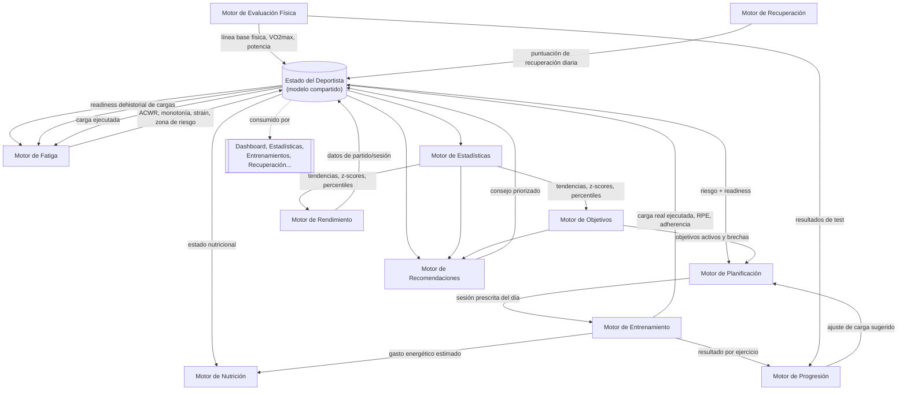
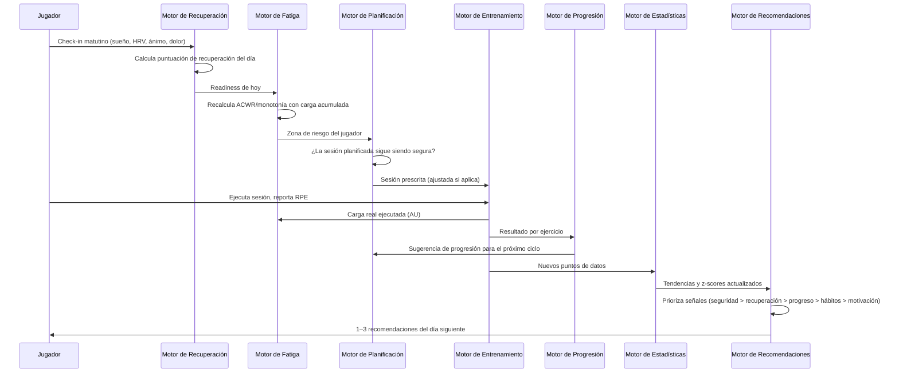

# F7 Performance Pro — El Cerebro: Motores Internos

**Versión:** 1.0 — arquitectura funcional de la lógica de dominio, sin código
**Rol:** diseño del departamento de rendimiento de un club profesional, trasladado a software
**Complementa a:** `ARCHITECTURE.md` (dónde vive esta capa), `MODULES_ROADMAP.md` (en qué módulo se implementa cada motor), `DASHBOARD_WIDGETS.md` (consumidores directos de la mayoría de estas salidas)

> Todo lo que la app "sabe" sobre un deportista pasa por estos 11 motores antes de llegar a una pantalla. Ninguna pantalla calcula nada por sí sola — los widgets, cards y gráficos son *vistas* de lo que el cerebro ya decidió. Esto es exactamente cómo trabaja un departamento de rendimiento real: el preparador físico no improvisa la sesión de hoy mirando una tabla suelta — la decide cruzando carga, recuperación, calendario de competición y objetivos individuales.

---

## 0. Filosofía del cerebro

1. **Individualización sobre normas poblacionales.** Cada motor compara primero contra la **línea base personal** del deportista (su propio histórico) y solo en segundo lugar contra normas de referencia por posición/edad/nivel. Un HRV de 45ms no significa lo mismo en dos jugadores distintos.
2. **Principio de precaución (safety-first).** Ante señales contradictorias entre motores, **siempre gana la señal más conservadora**. El Motor de Fatiga y el Motor de Recuperación tienen autoridad de veto sobre el Motor de Planificación y el Motor de Entrenamiento — nunca al revés (detalle en §5).
3. **Todo output es trazable.** Ninguna recomendación aparece "porque sí": cada motor guarda **de qué datos y qué regla salió** una decisión, para que un preparador físico humano pueda auditarla (requisito real de cualquier software de rendimiento profesional).
4. **Un estado compartido, no 11 silos.** Los motores no se llaman unos a otros directamente como funciones sueltas — todos leen y escriben sobre un modelo central, el **Estado del Deportista** (§2), que actúa como la "historia clínica de rendimiento" de cada jugador.
5. **Capa arquitectónica.** Esta lógica vive en una capa nueva, `src/engines/`, entre `services/` (acceso a datos) y `store/` (estado de UI) de `ARCHITECTURE.md §2`. Cada motor es un módulo de dominio puro (recibe datos, devuelve datos, sin acceso directo a `StorageAdapter` ni a React) — así se puede testear con datos sintéticos sin levantar la app, y se puede mover a un backend (Edge Function de Supabase) en `M23` sin reescribir la lógica.

---

## 1. Mapa general de los 11 motores

**Lectura:** el Estado del Deportista es el hub. Ningún motor lee directamente la salida de otro motor — todos pasan por ese estado compartido, lo que evita acoplamiento circular y permite que cualquier motor se recalcule de forma independiente (requisito de `MODULES_ROADMAP.md §4`, Definition of Done: "el store solo llama a su service").

---

## 2. Estado del Deportista (modelo de datos compartido)

Antes de entrar motor por motor, se define una vez el objeto que todos leen/escriben — evita repetir "qué guarda" de forma redundante en cada ficha.

| Sección | Contenido | Escrita por |
|---|---|---|
| `identity` | Datos base del `Player` (edad, posición, antropometría) | M05 (fuente), Evaluación Física (actualiza antropometría) |
| `baselines` | Línea base personal por métrica (media y desviación estándar móvil de los últimos 90 días) | Estadísticas, recalculado semanalmente |
| `loadHistory[]` | Serie temporal de carga diaria (AU) de los últimos 12 meses | Entrenamiento, Rendimiento (partidos) |
| `fatigueState` | ACWR actual, monotonía, strain, zona de riesgo, fitness/fatiga (Banister) | Fatiga |
| `recoveryState` | Puntuación de recuperación de hoy, sub-métricas, tendencia 14 días | Recuperación |
| `physicalProfile` | Últimos resultados de test físicos + VO2max estimado + potencia | Evaluación Física |
| `nutritionState` | TDEE actual, objetivos de macros del día, adherencia reciente | Nutrición |
| `goals[]` | Objetivos activos con progreso y proyección | Objetivos |
| `performanceIndex` | Índice compuesto de rendimiento reciente + tendencia | Rendimiento |
| `activeRiskFlags[]` | Alertas activas (sobrecarga, recuperación baja, lesión) con motor de origen | Fatiga, Recuperación, Lesiones |
| `recommendationLog[]` | Historial de recomendaciones emitidas, motor de origen, si se siguieron | Recomendaciones |

Este objeto **no es una tabla nueva de base de datos** — es una vista agregada que se recalcula a partir de las entidades ya definidas en `ARCHITECTURE.md §6.3` (`Player`, `TrainingSession`, `PerformanceMetric`, `WellnessCheckIn`, etc.) más las entidades nuevas que cada motor introduce (detalladas en cada ficha).

---

## 3. Los 11 motores

### 3.1 Motor de Entrenamiento

| | |
|---|---|
| **Rol** | Convierte la prescripción del Motor de Planificación en una sesión ejecutable, y captura lo que realmente ocurrió durante el entrenamiento. |
| **Frecuencia** | En cada sesión (tiempo real durante la ejecución) |

- **Datos que recibe:** sesión prescrita (tipo, duración objetivo, ejercicios, intensidad objetivo) del Motor de Planificación; ajuste de intensidad del Motor de Fatiga si hay riesgo activo; catálogo de ejercicios de Biblioteca (M10); RPE reportado por el jugador al finalizar cada ejercicio/sesión (escala CR10 de Borg); asistencia.
- **Datos que genera:** carga de la sesión (Session Load, en AU), carga por jugador (si difiere del plan), registro de ejecución real vs. planificada (adherencia %), eventos de sesión (series completadas, tiempos, RPE por bloque).
- **Cómo toma decisiones:** si el Motor de Fatiga marca al jugador en zona de riesgo alto el mismo día, el motor **reduce automáticamente el volumen prescrito** (no la técnica) en un % definido por regla, y lo señala visualmente como "sesión ajustada por carga" — nunca ejecuta la sesión original sin avisar.
- **Reglas que utiliza:**
  - Regla de ajuste por riesgo: ACWR > 1.5 → reducir volumen de la sesión 20–30%; recuperación < 40/100 → convertir sesión de alta intensidad en sesión técnica/regenerativa.
  - Regla de sesión mínima viable: ninguna sesión desciende de un umbral de estímulo mínimo (evita "vaciar" por completo el entrenamiento).
  - Regla de consentimiento: el ajuste automático siempre se muestra al coach antes de aplicarse, no se aplica en silencio.
- **Algoritmos:**
  - **Session-RPE (Foster et al.):** `Carga de sesión (AU) = RPE (0–10) × Duración (min)`.
  - Interpolación de RPE por bloque cuando el jugador reporta por ejercicio en vez de por sesión completa (media ponderada por duración de bloque).
- **Qué guarda:** `TrainingSession` (ya definido), nueva entidad `TrainingLoadRecord { id, playerId, sessionId, date, sessionRpe, durationMin, loadAU, source }` — uno por jugador y sesión (la carga puede diferir entre jugadores de la misma sesión).
- **Interacción con otros motores:** consume del Motor de Planificación y del Motor de Fatiga; alimenta con `loadAU` al Motor de Fatiga (recalcula ACWR), al Motor de Progresión (evalúa si el estímulo fue suficiente) y al Motor de Nutrición (gasto energético del día).

---

### 3.2 Motor de Progresión

| | |
|---|---|
| **Rol** | Decide si un jugador debe subir, mantener o bajar la carga/dificultad de un ejercicio o cualidad física concreta a lo largo del tiempo. |
| **Frecuencia** | Al cierre de cada sesión con datos de ejecución; recálculo semanal de tendencia |

- **Datos que recibe:** historial de rendimiento por ejercicio/cualidad (peso, velocidad, repeticiones, RPE reportado) del Motor de Entrenamiento; resultados de test físicos del Motor de Evaluación Física; zona de riesgo actual del Motor de Fatiga (no progresar en riesgo alto).
- **Datos que genera:** recomendación de progresión por ejercicio/cualidad (`subir`, `mantener`, `bajar`, `deload`), nuevo objetivo de carga para la próxima sesión de ese tipo, detección de meseta (*plateau*).
- **Cómo toma decisiones:** compara el RPE reportado de las últimas N sesiones de un mismo ejercicio contra el RPE objetivo. Si el RPE real es consistentemente menor al objetivo (el estímulo se quedó fácil), sugiere progresión; si es consistentemente mayor, sugiere mantener o bajar. Si no hay cambio en el resultado en ventana de 3–4 semanas, marca meseta y sugiere variar el estímulo (cambio de ejercicio, no solo de carga).
- **Reglas que utiliza:**
  - **Progresión autorregulada (APRE):** si RPE medio de las últimas 2–3 sesiones < objetivo − 1 punto → subir carga 2.5–5%.
  - **Regla de meseta:** sin mejora en la métrica objetivo durante ≥ 3 semanas con adherencia ≥ 80% → marcar meseta, sugerir cambio de estímulo.
  - **Regla de bloqueo por riesgo:** si el Motor de Fatiga marca zona roja, la progresión se congela aunque el rendimiento lo permita.
  - **Landmarks de volumen (Israetel: MEV/MAV/MRV):** el volumen semanal por cualidad no debe superar el Volumen Máximo Recuperable estimado del jugador ni caer bajo el Volumen Mínimo Efectivo.
- **Algoritmos:** media móvil de RPE (ventana 3 sesiones), regresión lineal simple sobre la métrica objetivo para detectar pendiente ≈ 0 (meseta), progresión porcentual escalonada (2.5–10% según cualidad).
- **Qué guarda:** `ProgressionRecord { id, playerId, exerciseId/qualityType, currentTarget, trend, plateauDetected, lastAdjustmentDate, adjustmentReason }`.
- **Interacción con otros motores:** recibe de Entrenamiento y Evaluación Física; envía su sugerencia al Motor de Planificación (que decide si la incorpora al próximo microciclo) y al Motor de Objetivos (actualiza el progreso hacia una meta relacionada).

---

### 3.3 Motor de Recuperación

| | |
|---|---|
| **Rol** | Calcular cuán preparado está el cuerpo del deportista hoy para tolerar carga — el "Body Battery" de F7. |
| **Frecuencia** | Diaria (al completar el check-in matutino), recálculo continuo si llegan datos de wearable |

- **Datos que recibe:** `WellnessCheckIn` (sueño, FC en reposo, HRV, estado de ánimo, dolor muscular por zona) del check-in diario; carga de las últimas 72h del Motor de Fatiga; datos de wearable si están conectados (M29, v3.0).
- **Datos que genera:** puntuación de recuperación (0–100), etiqueta cualitativa (Óptima/Moderada/Baja/Crítica), desglose por sub-métrica, tendencia de 14 días.
- **Cómo toma decisiones:** cada sub-métrica se convierte a un **z-score contra la línea base personal** del jugador (no un valor absoluto — 60ms de HRV puede ser excelente o pobre según el individuo). Los z-scores se combinan en una puntuación compuesta ponderada; si faltan datos (p. ej. sin HRV), se redistribuye el peso entre las métricas disponibles en vez de penalizar.
- **Reglas que utiliza:**
  - Ponderación por defecto: Sueño 30%, HRV 25%, FC en reposo 20%, Dolor muscular subjetivo 15%, Estado de ánimo 10% (configurable por el cuerpo técnico).
  - Zona **Óptima** ≥ 75, **Moderada** 50–74, **Baja** 30–49, **Crítica** < 30.
  - Regla de alerta: 2 días consecutivos en zona Crítica → se genera automáticamente un `activeRiskFlag` visible al coach, no solo al jugador.
- **Algoritmos:**
  - Z-score personal: `z = (valor_hoy − media_móvil_28d) / desviación_estándar_28d`.
  - Suavizado exponencial (EWMA) para la tendencia de 14 días, evitando que un solo mal dato dispare la alerta.
  - Redistribución de pesos proporcional cuando faltan sub-métricas (normalización a suma 1).
- **Qué guarda:** `WellnessCheckIn` (ya definido en M16) + `RecoveryScoreRecord { id, playerId, date, score, subScores{}, zone }`.
- **Interacción con otros motores:** alimenta directamente al Motor de Fatiga (readiness del día) y, mediante este, al Motor de Planificación/Entrenamiento; el Motor de Lesiones consulta su historial para correlacionar caídas de recuperación con aparición de molestias.

---

### 3.4 Motor de Fatiga

| | |
|---|---|
| **Rol** | El motor de **prevención de lesiones** — cuantifica cuánta carga acumulada lleva el jugador y si esa carga es segura respecto a su capacidad reciente. Es el de mayor autoridad de veto de todo el sistema. |
| **Frecuencia** | Recálculo diario tras cada sesión registrada |

- **Datos que recibe:** `loadHistory[]` (carga diaria de los últimos 28+ días) del Motor de Entrenamiento y Rendimiento (partidos también generan carga); puntuación de recuperación del día del Motor de Recuperación.
- **Datos que genera:** ACWR actual, monotonía, strain, estado Fitness/Fatiga (modelo Banister), zona de riesgo (`óptima`/`atención`/`alto riesgo`), bandera de riesgo activa si corresponde.
- **Cómo toma decisiones:** calcula la carga aguda (7 días) y crónica (28 días) mediante medias móviles exponenciales, obtiene el ratio, y lo cruza con la monotonía semanal — una ACWR aceptable con monotonía alta (entrenamientos muy parecidos día tras día, sin variación) **también** dispara alerta, porque el riesgo real de Foster combina ambos factores (strain), no solo el ratio.
- **Reglas que utiliza:**
  - **Zona óptima ("sweet spot"):** ACWR 0.8–1.3.
  - **Zona de atención:** ACWR 1.3–1.5 o < 0.8 (desentrenamiento, también es un riesgo).
  - **Zona de alto riesgo:** ACWR > 1.5.
  - **Regla de monotonía:** monotonía semanal > 2.0 → riesgo elevado independientemente del ACWR.
  - **Regla de veto:** si la zona es "alto riesgo", el Motor de Fatiga **fuerza** un ajuste descendente en el Motor de Planificación para el microciclo en curso — este es el único motor con permiso de modificar el plan sin pasar por el Motor de Recomendaciones primero (ver §5).
- **Algoritmos:**
  - **EWMA:** `EWMA_hoy = Carga_hoy × λ + EWMA_ayer × (1 − λ)`, con `λ_aguda = 2/(7+1)` y `λ_crónica = 2/(28+1)`.
  - **ACWR:** `EWMA_aguda / EWMA_crónica`.
  - **Monotonía (Foster):** `media semanal de carga diaria / desviación estándar de carga diaria`.
  - **Strain:** `carga total semanal × monotonía`.
  - **Modelo Fitness–Fatiga (Banister, impulse-response):** Fitness(t) y Fatiga(t) como convoluciones exponenciales de la carga diaria con constantes de tiempo distintas (~42 días fitness, ~7 días fatiga); Rendimiento potencial(t) = Fitness(t) − Fatiga(t) — usado para proyectar el mejor momento de "pico de forma" de cara a un partido importante.
- **Qué guarda:** `ACWRSnapshot { id, playerId, date, acuteLoad, chronicLoad, acwr, monotony, strain, zone }`, `activeRiskFlags[]` en el Estado del Deportista.
- **Interacción con otros motores:** consume de Entrenamiento y Rendimiento (carga) y de Recuperación (readiness); su salida condiciona directamente al Motor de Planificación y al Motor de Entrenamiento, y sus banderas de riesgo alimentan al Motor de Recomendaciones y al Motor de Lesiones (correlación carga↔lesión).

---

### 3.5 Motor de Nutrición

| | |
|---|---|
| **Rol** | Calcular las necesidades energéticas y de macronutrientes del día según el gasto real, y evaluar la adherencia del deportista a esos objetivos. |
| **Frecuencia** | Diaria (recalcula el objetivo del día por la mañana según lo planificado, ajusta si la sesión real difiere) |

- **Datos que recibe:** antropometría (peso, altura, edad, sexo) de `identity`; carga/gasto energético estimado de la sesión del día del Motor de Entrenamiento; tipo de día de entrenamiento del Motor de Planificación (descanso/bajo/moderado/alto, para periodizar carbohidratos); comidas e hidratación registradas (M18).
- **Datos que genera:** objetivo calórico del día (TDEE ajustado), objetivo de macros (g de proteína/carbohidratos/grasas), objetivo de hidratación, adherencia % contra lo registrado, alerta si hay déficit sostenido no intencionado.
- **Cómo toma decisiones:** el objetivo calórico base (BMR × factor de actividad) se ajusta **hacia arriba** en los días de mayor carga prevista, y el reparto de carbohidratos se "periodiza" para que los días de alta demanda tengan más carbohidrato disponible antes/después del entrenamiento (nutrición periodizada, no una cifra fija los 7 días).
- **Reglas que utiliza:**
  - Proteína: 1.6–2.2 g/kg de peso corporal (rango estándar para deportistas de conjunto).
  - Carbohidratos periodizados: día de descanso 3–4 g/kg, día moderado 5–6 g/kg, día de alta carga o partido 7–10 g/kg.
  - Grasas: resto de calorías tras proteína y carbohidratos, con un mínimo de 0.8 g/kg (salud hormonal).
  - Hidratación base: 35 ml/kg + estimación de pérdida por sudor según duración/intensidad de la sesión.
  - Alerta de déficit: 5 días consecutivos con ingesta < 85% del objetivo calórico → bandera al coach/nutricionista.
- **Algoritmos:**
  - **BMR (Mifflin–St Jeor):** hombres `10×peso + 6.25×altura − 5×edad + 5`; mujeres `10×peso + 6.25×altura − 5×edad − 161`.
  - **TDEE:** `BMR × factor de actividad base + kcal estimadas de la(s) sesión(es) del día` (conversión aproximada de AU de carga a kcal mediante coeficiente calibrable por deporte).
  - Reparto de macros como función del tipo de día (tabla de periodización de carbohidratos, no fórmula continua).
- **Qué guarda:** `NutritionTarget { id, playerId, date, kcalTarget, proteinG, carbsG, fatG, hydrationMlTarget, dayType }`, adherencia calculada contra `MealEntry`/`HydrationEntry` ya definidos en M18.
- **Interacción con otros motores:** recibe del Motor de Entrenamiento (gasto real) y Planificación (tipo de día); su adherencia alimenta al Motor de Recomendaciones (si hay déficit sostenido, sugiere ajuste antes de que impacte en Rendimiento/Recuperación).

---

### 3.6 Motor de Planificación

| | |
|---|---|
| **Rol** | El "director técnico" del sistema — construye el calendario de entrenamiento a 3 niveles (macro/meso/microciclo) y decide qué se entrena cada día. |
| **Frecuencia** | Macrociclo: al inicio de temporada. Mesociclo: cada 4–6 semanas. Microciclo: semanal, con ajustes diarios reactivos |

- **Datos que recibe:** calendario de competición (fechas de partidos, `Match`), objetivos activos del Motor de Objetivos, estado de riesgo del Motor de Fatiga, sugerencias del Motor de Progresión, disponibilidad del jugador (lesiones, del Motor de Lesiones).
- **Datos que genera:** macrociclo de temporada (fases: pretemporada/competitiva/transición), mesociclo actual (bloque con objetivo dominante: fuerza, resistencia, técnica...), microciclo de la semana (distribución de tipos de sesión por día), sesión prescrita del día para el Motor de Entrenamiento.
- **Cómo toma decisiones:** distribuye la carga semanal siguiendo un modelo de periodización elegido (lineal en pretemporada, ondulante/por bloques en competitiva), y aplica un **táper** (reducción progresiva de volumen manteniendo intensidad) en los 2–4 días previos a un partido marcado como importante en el calendario. Si el Motor de Fatiga marca riesgo alto para un jugador específico, genera una variante individual de la sesión para ese jugador sin alterar el plan del resto del equipo.
- **Reglas que utiliza:**
  - Regla de proximidad a partido: ≤ 48h antes de competición → solo sesiones de intensidad baja-media, foco técnico/táctico, nunca fuerza máxima nueva.
  - Regla de post-partido: día siguiente a competición = recuperación activa obligatoria, no se planifica carga alta.
  - Regla de variedad: ningún microciclo repite el mismo tipo de sesión dominante más de 2 días consecutivos (control de monotonía en origen, coordinado con el Motor de Fatiga).
  - Regla de individualización forzada: una bandera de riesgo alto de un jugador siempre genera una sesión individual alternativa, nunca se ignora a nivel de plan de equipo.
- **Algoritmos:** plantillas de periodización (lineal, por bloques de Issurin, ondulante) parametrizadas por fase de temporada; función de táper exponencial decreciente de volumen en los días previos a competición; balanceo de distribución semanal por tipo de sesión como problema de asignación simple con restricciones (no ML — reglas + plantillas, como haría un preparador físico real).
- **Qué guarda:** `Macrocycle { id, teamId, season, phases[] }`, `Mesocycle { id, macrocycleId, startDate, endDate, focus }`, `Microcycle { id, mesocycleId, weekStart, sessionDistribution[] }` — de aquí es de donde el Motor de Entrenamiento obtiene la prescripción de cada `TrainingSession`.
- **Interacción con otros motores:** es el motor con más aristas entrantes (recibe de Fatiga, Progresión, Objetivos, Lesiones, calendario de Partidos) y su única salida operativa es hacia el Motor de Entrenamiento — actúa como el "compilador" que traduce todas esas señales en la sesión concreta de hoy.

---

### 3.7 Motor de Recomendaciones

| | |
|---|---|
| **Rol** | La "voz del entrenador" — traduce las salidas técnicas de los demás motores en 1–3 recomendaciones priorizadas, en lenguaje humano, sin que el usuario tenga que interpretar números. |
| **Frecuencia** | Recálculo diario (tras el check-in matutino) y bajo demanda tras eventos relevantes (sesión completada, test registrado) |

- **Datos que recibe:** el Estado del Deportista completo (es el único motor que lee de todas las secciones), con énfasis en `activeRiskFlags`, `recoveryState`, `fatigueState`, `goals[]`, adherencia nutricional.
- **Datos que genera:** lista priorizada de recomendaciones (máximo 3, para no saturar), cada una con: mensaje, motor de origen, severidad, acción sugerida (link a la pantalla relevante).
- **Cómo toma decisiones:** sistema experto basado en reglas con **prioridad jerárquica fija** (no aprendida): primero seguridad (riesgo de lesión/sobrecarga), después recuperación, después nutrición/objetivos, por último motivacional/informativo. Si dos reglas se disparan a la vez, gana la de mayor severidad; nunca se muestran dos recomendaciones contradictorias (p. ej. "sube la intensidad" y "hoy descansa" jamás coexisten — se filtra la de menor prioridad).
- **Reglas que utiliza:**
  - Prioridad 1 (seguridad): `activeRiskFlags` de Fatiga o Lesiones → siempre se muestra primero, tono directo.
  - Prioridad 2 (recuperación): zona Baja/Crítica de Recuperación sin bandera de riesgo aún → recomendación preventiva.
  - Prioridad 3 (progreso/objetivos): meseta detectada por Progresión, o objetivo con proyección de incumplimiento (Motor de Objetivos).
  - Prioridad 4 (nutrición/hábitos): adherencia nutricional baja sostenida.
  - Prioridad 5 (motivacional): sin ninguna señal negativa activa → mensaje de refuerzo positivo o dato destacado de Rendimiento/Estadísticas.
  - Regla de no repetición: la misma recomendación no se repite dos días seguidos si no cambió la causa que la generó (evita fatiga de notificación).
- **Algoritmos:** motor de reglas (rule engine) con tabla de prioridad y condiciones; plantillas de texto parametrizadas por severidad y motor de origen (no generación libre de texto en v1.0–v1.5 — la variante con IA generativa real es explícitamente `M28`, v3.0).
- **Qué guarda:** `RecommendationLog { id, playerId, date, sourceEngine, message, severity, shown, actedOn }` — el campo `actedOn` es lo que permite, a futuro, medir si las recomendaciones realmente se siguen (insumo del Motor de Rendimiento para validar si el sistema funciona).
- **Interacción con otros motores:** es puramente consumidor — lee de todos, no escribe en ninguno salvo en su propio log. Es la implementación funcional del widget "Consejo del Día" (`DASHBOARD_WIDGETS.md #28`).

---

### 3.8 Motor de Estadísticas

| | |
|---|---|
| **Rol** | Biblioteca de cálculo compartida: tendencias, comparativas, percentiles. No decide nada por sí mismo — calcula lo que los demás motores necesitan para decidir. |
| **Frecuencia** | Bajo demanda (cada vez que otro motor o pantalla necesita un cálculo) + agregación nocturna programada |

- **Datos que recibe:** cualquier serie temporal del Estado del Deportista o de las entidades base (`PerformanceMetric`, `loadHistory`, `RecoveryScoreRecord`, etc.).
- **Datos que genera:** medias, medianas, desviaciones estándar, z-scores, percentiles, pendiente de tendencia (mejora/estable/empeora), comparación contra la media del equipo o de la posición.
- **Cómo toma decisiones:** no "decide" en el sentido de negocio — aplica funciones estadísticas puras y devuelve resultados neutros; la interpretación de negocio (¿es bueno o malo este número?) la hace el motor que lo consume (Fatiga, Recomendaciones, etc.), nunca este motor.
- **Reglas que utiliza:** ventanas estándar de cálculo (7/14/28/90 días) unificadas para que todos los motores hablen "el mismo idioma temporal"; mínimo de puntos de datos requeridos antes de calcular una tendencia con confianza (n ≥ 5, si no, se marca `insuficiente` en vez de forzar un resultado engañoso.
- **Algoritmos:**
  - Media, mediana, desviación estándar, rango intercuartílico.
  - Z-score contra línea base personal y contra población de referencia (equipo/posición).
  - Percentil rank dentro de un grupo comparativo.
  - Regresión lineal simple (mínimos cuadrados) para pendiente de tendencia.
  - Suavizado exponencial (EWMA) reutilizado por Fatiga y Recuperación con la misma implementación base.
- **Qué guarda:** no persiste entidades propias — cachea resultados calculados (`baselines` dentro del Estado del Deportista) con fecha de último recálculo, para no recomputar sobre toda la serie histórica en cada acceso.
- **Interacción con otros motores:** es infraestructura transversal — Fatiga, Recuperación, Progresión, Objetivos, Rendimiento y Evaluación Física lo usan como librería común. Directamente también alimenta la pantalla `/stats` (M15).

---

### 3.9 Motor de Objetivos

| | |
|---|---|
| **Rol** | Convertir metas declaradas (o sugeridas por el sistema) en seguimiento cuantitativo con proyección de cumplimiento. |
| **Frecuencia** | Recálculo tras cada nuevo dato relevante a un objetivo activo (test, sesión, métrica de rendimiento) |

- **Datos que recibe:** objetivo declarado por el usuario/coach (métrica, valor objetivo, fecha límite); histórico y tendencia de esa métrica del Motor de Estadísticas; resultados de test del Motor de Evaluación Física.
- **Datos que genera:** % de progreso hacia el objetivo, fecha proyectada de cumplimiento (o alerta de que no se cumplirá al ritmo actual), sugerencias automáticas de nuevos objetivos basadas en brechas detectadas (p. ej. velocidad de sprint por debajo del percentil 40 de su posición → sugiere objetivo de velocidad).
- **Cómo toma decisiones:** valida que el objetivo declarado sea **SMART** (específico, medible, con fecha) antes de aceptarlo; proyecta la fecha de cumplimiento extrapolando la pendiente de tendencia actual (Motor de Estadísticas) hacia el valor objetivo; si la proyección supera la fecha límite, marca el objetivo "en riesgo" y lo eleva al Motor de Recomendaciones.
- **Reglas que utiliza:**
  - Un objetivo requiere: métrica cuantificable existente en el sistema, valor objetivo, fecha límite ≥ 2 semanas desde hoy (evita metas irreales a corto plazo).
  - Objetivo "en riesgo": proyección de cumplimiento > fecha límite con el ritmo de progreso actual.
  - Objetivo "cumplido": valor real alcanza o supera el objetivo antes de la fecha límite → dispara evento hacia el Motor de Objetivos... y hacia Logros/Gamificación (M21).
  - Sugerencia automática: cualquier métrica con percentil personal < 40 respecto a su grupo comparativo y sin objetivo activo asociado → candidata a sugerencia (máximo 1 sugerencia activa por categoría para no saturar).
- **Algoritmos:** extrapolación lineal de la tendencia (misma regresión del Motor de Estadísticas) proyectada hasta el valor objetivo para estimar fecha; regla de brecha basada en percentil para las sugerencias automáticas.
- **Qué guarda:** `Goal { id, playerId, metricType, targetValue, currentValue, deadline, status, projectedCompletionDate, autoSuggested }`.
- **Interacción con otros motores:** consume de Estadísticas y Evaluación Física; informa al Motor de Planificación (un objetivo activo influye en qué cualidad se prioriza en el próximo mesociclo) y al Motor de Recomendaciones (objetivos en riesgo).

---

### 3.10 Motor de Evaluación Física

| | |
|---|---|
| **Rol** | Gestiona la batería de tests físicos periódicos y traduce sus resultados brutos en métricas estandarizadas comparables en el tiempo. |
| **Frecuencia** | Por ciclo de testing (típicamente cada 4–6 semanas, alineado a mesociclos) |

- **Datos que recibe:** resultados brutos de test (tiempo de sprint 30m, distancia Yo-Yo IR1, altura de salto CMJ, test de agilidad 505, rango de movimiento), antropometría del jugador, fecha del último test del mismo tipo.
- **Datos que genera:** métricas derivadas estandarizadas (VO2max estimado, potencia de salto, velocidad máxima, índice de agilidad), comparación contra el test anterior (mejora/retroceso %) y contra normas de referencia por posición/edad, calendario de próxima evaluación.
- **Cómo toma decisiones:** cada test bruto pasa por su fórmula de conversión específica a una métrica estandarizada; el resultado se compara primero contra el propio histórico del jugador (¿mejoró desde el último test?) y después contra tablas de referencia por posición (¿dónde está respecto a un central de su edad?). Programa automáticamente el recordatorio del siguiente ciclo de test según la cualidad evaluada.
- **Reglas que utiliza:**
  - Cadencia de testing recomendada por cualidad: potencia/velocidad cada 4 semanas, resistencia (Yo-Yo) cada 6–8 semanas, antropometría mensual.
  - Regla de validez: un test se descarta si las condiciones no son comparables (p. ej. realizado en fatiga alta activa del Motor de Fatiga) — se marca como "no válido para comparación" en vez de contaminar la tendencia.
  - Regla de alerta de retroceso: caída > 10% en una métrica clave respecto al test anterior sin causa de lesión conocida → bandera hacia Recomendaciones.
- **Algoritmos:**
  - **VO2max desde Yo-Yo IR1 (Bangsbo):** `VO2max = distancia(m) × 0.0084 + 36.4`.
  - **Potencia de salto CMJ (Sayers):** `Potencia(W) = 60.7 × altura_salto(cm) + 45.3 × peso(kg) − 2055`.
  - **Velocidad máxima:** derivada directa de tiempo/distancia en sprint lineal (splits a 10/20/30m si están disponibles, para separar aceleración de velocidad máxima).
  - Comparación contra tabla de normas por posición/edad (percentil rank, reutilizando el Motor de Estadísticas).
- **Qué guarda:** `PhysicalTestResult { id, playerId, testType, date, rawValue, derivedValue, unit, validForComparison, conditionsFlag }`.
- **Interacción con otros motores:** alimenta directamente el `physicalProfile` del Estado del Deportista, consumido por Progresión (ajusta cargas con datos reales de capacidad), Objetivos (progreso hacia metas físicas) y Estadísticas (radar de perfil físico en `/stats`).

---

### 3.11 Motor de Rendimiento

| | |
|---|---|
| **Rol** | El motor de "resultado" — mide lo que realmente ocurre en la cancha (partidos y sesiones de alta exigencia) y cierra el ciclo de retroalimentación de todo el sistema. |
| **Frecuencia** | Tras cada partido/sesión relevante registrada |

- **Datos que recibe:** eventos y datos de `Match`/`MatchEvent` (minutos jugados, goles, asistencias, acciones técnicas), carga de la sesión/partido del Motor de Entrenamiento, contexto de recuperación/fatiga del día del partido.
- **Datos que genera:** índice de rendimiento compuesto por partido, tendencia de rendimiento (mejora/estable/declive), correlación entre rendimiento y las variables de otros motores (¿el rendimiento cae cuando el ACWR está en zona de riesgo? ¿mejora cuando la recuperación pre-partido fue alta?).
- **Cómo toma decisiones:** normaliza las distintas acciones de partido según su relevancia por posición (un central no se evalúa igual que un delantero) para construir el índice compuesto; cruza ese índice contra las series históricas de carga/recuperación del mismo periodo usando el Motor de Estadísticas para detectar correlaciones, y expone esas correlaciones como evidencia (no como causalidad garantizada) al cuerpo técnico.
- **Reglas que utiliza:**
  - Ponderación de acciones por posición (configurable por el cuerpo técnico, con valores por defecto razonables por rol táctico).
  - Regla de contexto mínimo: un partido con < 20 minutos jugados no se pondera igual que uno completo (ajuste por minutos jugados).
  - Regla de correlación con evidencia mínima: no se muestra una correlación al usuario con menos de 5 partidos de datos comparables (evita conclusiones prematuras).
- **Algoritmos:** índice compuesto ponderado (suma de acciones normalizadas × peso posicional); coeficiente de correlación simple (Pearson) entre el índice de rendimiento y variables de Fatiga/Recuperación de la misma fecha, calculado vía el Motor de Estadísticas.
- **Qué guarda:** `PerformanceIndexRecord { id, playerId, matchId/sessionId, date, compositeScore, minutesPlayed, contextFlags[] }`.
- **Interacción con otros motores:** consume de Partidos/Entrenamiento y del contexto de Fatiga/Recuperación vía el Estado del Deportista; su índice y sus correlaciones alimentan al Motor de Estadísticas (tendencias visibles en `/stats`) y al Motor de Recomendaciones (evidencia de que "cuando descansas bien, rindes mejor" es literalmente calculable y mostrable al jugador — el cierre motivacional del ciclo).

---

## 4. Ciclo de orquestación diario

---

## 5. Resolución de conflictos entre motores

Jerarquía de autoridad, de mayor a menor capacidad de "vetar" una decisión de otro motor:

1. **Motor de Fatiga** — puede forzar la reducción de una sesión sin pasar por aprobación de otro motor (riesgo de lesión no es negociable).
2. **Motor de Recuperación** — puede degradar el tipo de sesión propuesta (de alta intensidad a regenerativa) si la puntuación es Crítica.
3. **Motor de Planificación** — decide dentro de los límites que le imponen los dos anteriores.
4. **Motor de Progresión / Objetivos / Nutrición** — informan y sugieren, pero nunca alteran una sesión ya aprobada por los tres niveles anteriores.
5. **Motor de Recomendaciones** — nunca decide nada operativo; solo comunica. Es el único motor con contacto directo y constante con el usuario.

Regla general: **ninguna recomendación o ajuste automático puede aumentar el riesgo** — ante ambigüedad o falta de datos, el sistema siempre elige la opción más conservadora y deja rastro auditable de por qué.

---

## 6. Mapeo motores ↔ módulos del roadmap

| Motor | Vive principalmente en | Es transversal a |
|---|---|---|
| Entrenamiento | M07 Entrenamientos | M09 Dashboard |
| Progresión | M07 Entrenamientos, M10 Biblioteca | M15 Estadísticas |
| Recuperación | M16 Recuperación | M09 Dashboard |
| Fatiga | M15 Estadísticas, M16 Recuperación | M07, M14, M17 |
| Nutrición | M18 Nutrición | M07 (gasto energético) |
| Planificación | M07 Entrenamientos, M08 Calendario | M14 Partidos |
| Recomendaciones | M09 Dashboard (widget #28) | Todos |
| Estadísticas | M15 Estadísticas | Todos (librería compartida) |
| Objetivos | Perfil (M11/M21) | M15 Estadísticas |
| Evaluación Física | M15 Estadísticas | M07 (ajuste de cargas) |
| Rendimiento | M14 Partidos, M15 Estadísticas | M09 Dashboard |

Este documento, junto con `MODULES_ROADMAP.md`, define **qué construir y por qué se comporta así** — la próxima capa de trabajo es elegir el primer motor a implementar (recomendación: Motor de Entrenamiento + Motor de Fatiga en paralelo con `M07`, porque son la base de la que dependen prácticamente todos los demás).
