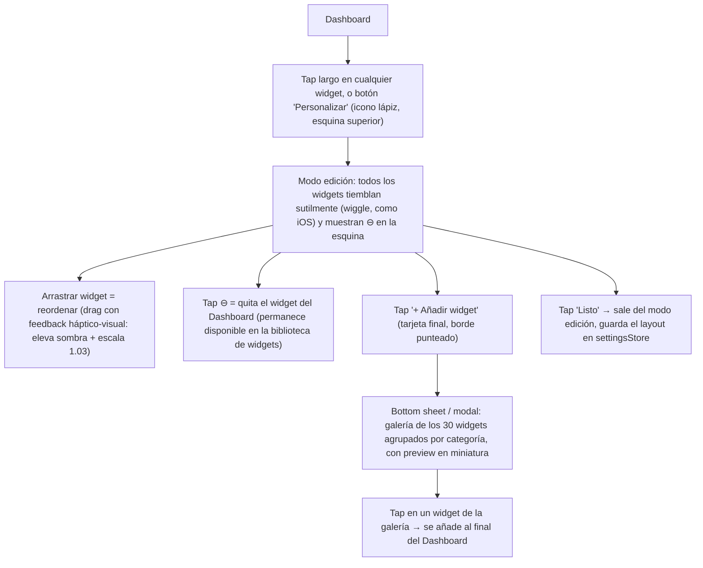

# F7 Performance Pro — Dashboard: Sistema de Widgets

**Versión:** 1.0 — especificación de widgets, sin código
**Referencia de nivel:** Garmin Connect ("My Day"), Apple Fitness Sharing/Summary
**Complementa a:** `UX_DESIGN.md §1` (layout base del Dashboard), `DESIGN_SYSTEM.md` (tokens), `NAVIGATION_FLOW.md` (a dónde navega cada widget)

Este documento reemplaza y expande `UX_DESIGN.md §1`: el Dashboard deja de ser una pantalla de secciones fijas y pasa a ser un **sistema de widgets personalizable** — el usuario elige cuáles ver, en qué orden, igual que el "My Day" de Garmin Connect o la pantalla de widgets de iOS. Se especifican **30 widgets**, cada uno con función, datos, acciones, visualización, animación y sus 3 estados (vacío/cargando/error).

---

## 1. Filosofía: Dashboard como sistema de widgets

- El Dashboard es una **colección ordenable de tarjetas independientes**, no una pantalla con secciones hardcodeadas. Cada widget es autocontenido: sabe pedir sus propios datos, animarse, y mostrar sus propios estados — no depende de que el resto del Dashboard cargue para renderizarse (carga independiente, igual que Garmin Connect nunca bloquea todo "My Day" porque el widget de sueño tarda en llegar).
- Todo widget tiene **dos niveles de detalle**: la vista *glance* (lo que se ve en el Dashboard, compacta) y, al tocarla, una navegación a la vista *completa* de ese dominio (Estadísticas, Nutrición, Recuperación, etc.) — el widget nunca es un callejón sin salida.
- Un subconjunto de widgets es **condicional por rol** (coach/admin) o **condicional por contexto** (solo aparece si hay una lesión activa, o si hay un entrenamiento al aire libre programado).

---

## 2. Sistema de grid de widgets

| Tamaño | Mobile | Desktop (grid de 12 col, `DESIGN_SYSTEM.md §7`) | Uso típico |
|---|---|---|---|
| **S** — Small | Media fila (2 por fila) | 3 columnas (4 por fila) | Stat tile compacto, un número + tendencia |
| **M** — Medium | Fila completa | 4 columnas (3 por fila) | Widget estándar con mini-gráfico |
| **L** — Large | Fila completa, más alto | 6 columnas (2 por fila) | Widget con gráfico grande o lista |
| **Hero** | Fila completa, máxima altura | 12 columnas (1 por fila) | Anillos, sesión de hoy, resumen de equipo |

Comportamiento: en mobile los widgets `S` se emparejan automáticamente de dos en dos en la misma fila (como las stat chips ya descritas en `UX_DESIGN.md`); en desktop el motor de layout reordena tipo *masonry* respetando el orden de preferencia del usuario y rellenando huecos.

---

## 3. Modo de personalización

El layout personalizado se persiste por usuario (`settingsStore.dashboardLayout`, array ordenado de IDs de widget + visibilidad). Existe un botón "Restaurar orden recomendado" dentro de la galería para volver al layout por defecto (§5).

---

## 4. Catálogo completo de widgets (30)

### Categoría A — Rendimiento y Carga

#### 1. Anillos de Rendimiento — `Hero`
| Aspecto | Detalle |
|---|---|
| **Función** | Resumen instantáneo del estado general del deportista: cuánta carga lleva, cuánto ha recuperado, cuánto le falta para su objetivo semanal — el widget ancla de todo el Dashboard. |
| **Datos** | 3 anillos concéntricos: Carga de entrenamiento (7 días), Recuperación (hoy), Objetivo semanal (sesiones completadas/planificadas). Número central = promedio ponderado de los 3. |
| **Acciones** | Tap en el widget → `/stats`. Tap en un anillo específico → sección correspondiente (Carga→Estadísticas, Recuperación→`/recovery`, Objetivo→`/trainings`). |
| **Gráfico** | SVG custom, 3 arcos de grosor 10–12px, cap redondeado, tracks de fondo visibles. |
| **Animación** | Dibujo secuencial exterior→interior (150ms de delay entre anillos), 900ms `ease-out` cada uno; al re-visitar la pantalla en la misma sesión, no vuelve a animar desde 0 (interpola desde el valor anterior). |
| **Estado vacío** | Usuario sin ningún dato aún: anillos en gris neutro al 100%, texto central "Empieza tu primera sesión" + CTA. |
| **Estado cargando** | Skeleton circular con shimmer radial (rotación sutil del brillo). |
| **Estado error** | Anillos quedan en el último valor conocido (caché) + icono de aviso pequeño esquina superior + tooltip "Datos desactualizados". |

#### 2. Carga de Entrenamiento (Acute:Chronic Ratio) — `M`
| Aspecto | Detalle |
|---|---|
| **Función** | Alerta temprana de riesgo de lesión por sobrecarga o pérdida de forma, comparando carga aguda (7 días) vs. crónica (28 días) — concepto directo de Garmin/Training Peaks. |
| **Datos** | Ratio numérico (ej. "1.3"), zona de color (Detraining/Óptima/Riesgo alto), mini barra de las 4 últimas semanas. |
| **Acciones** | Tap → `/stats` filtrado a "Carga". Icono `ⓘ` abre tooltip explicando el ratio. |
| **Gráfico** | Barra horizontal segmentada por zonas (verde/ámbar/rojo) con marcador de posición actual. |
| **Animación** | El marcador se desliza desde el extremo izquierdo hasta su posición real (600ms `ease-out`). |
| **Estado vacío** | "Necesitas 2 semanas de datos para calcular tu carga" + icono candado sobre el widget. |
| **Estado cargando** | Skeleton de barra + texto shimmer. |
| **Estado error** | Barra en gris + "No se pudo calcular — Reintentar" (texto-botón inline). |

#### 3. Estado de Forma (Training Status) — `M`
| Aspecto | Detalle |
|---|---|
| **Función** | Clasificación cualitativa del momento de forma (igual que Garmin: Máximo rendimiento / Productivo / Manteniendo / Recuperación / Sobreentrenado / Improductivo). |
| **Datos** | Etiqueta de estado + icono direccional, breve explicación de una línea ("Tu carga y tu forma están subiendo juntas"). |
| **Acciones** | Tap → `/stats` sección "Perfil físico". |
| **Gráfico** | Icono de tendencia (flecha/gráfico de 2 líneas cruzándose) en vez de chart completo — es un widget de lectura rápida, no analítico. |
| **Animación** | El icono de estado hace una entrada con leve "pop" (scale 0.8→1) al cambiar de categoría respecto a la visita anterior. |
| **Estado vacío** | "Aún no podemos clasificar tu estado de forma" + progreso "3/14 días necesarios". |
| **Estado cargando** | Skeleton de icono + 2 líneas de texto. |
| **Estado error** | Última clasificación conocida + badge "desactualizado". |

#### 4. VO2 Max Estimado — `S`
| Aspecto | Detalle |
|---|---|
| **Función** | Indicador de capacidad aeróbica estimada, referencia estándar de fitness cardiovascular. |
| **Datos** | Número (ml/kg/min) + flecha de tendencia vs. mes anterior + rango cualitativo (Bajo/Medio/Bueno/Excelente para su edad/posición). |
| **Acciones** | Tap → `/stats` con métrica "VO2max" preseleccionada. |
| **Gráfico** | Sparkline de 8 semanas de fondo, muy sutil (15% opacidad). |
| **Animación** | Count-up del número (500ms) al montar. |
| **Estado vacío** | "Registra un test de resistencia para ver tu VO2max" + CTA a Biblioteca (test sugerido). |
| **Estado cargando** | Skeleton numérico + sparkline shimmer. |
| **Estado error** | Último valor + icono de aviso pequeño. |

#### 5. Predicción de Velocidad Máxima — `S`
| Aspecto | Detalle |
|---|---|
| **Función** | Proyección de la velocidad máxima esperable en el próximo test/partido, basada en la tendencia reciente (equivalente al "Race Predictor" de Garmin, adaptado a sprint). |
| **Datos** | Valor proyectado (km/h) + delta respecto al último registro real. |
| **Acciones** | Tap → `/stats` gráfico de velocidad. |
| **Gráfico** | Icono de rayo/flecha ascendente, sin chart completo (widget de una sola cifra). |
| **Animación** | Count-up + icono con pulso único al aparecer una mejora. |
| **Estado vacío** | "Necesitamos 3 registros de velocidad para proyectar" |
| **Estado cargando** | Skeleton numérico. |
| **Estado error** | Guion largo "—" + "No disponible ahora". |

#### 6. Minutos de Intensidad Semanal — `M`
| Aspecto | Detalle |
|---|---|
| **Función** | Cuánto volumen de esfuerzo de alta/moderada intensidad se ha acumulado esta semana frente a un objetivo (concepto Garmin "Intensity Minutes"). |
| **Datos** | "142 / 150 min" + desglose Moderada vs Vigorosa (cada minuto vigoroso cuenta doble). |
| **Acciones** | Tap → `/trainings` filtrado por esta semana. |
| **Gráfico** | Barra de progreso doble (dos segmentos de color apilados: moderada/vigorosa). |
| **Animación** | Barra crece de izquierda a derecha (700ms), con "rebote" final si supera el 100%. |
| **Estado vacío** | Barra vacía + "Aún no hay minutos esta semana". |
| **Estado cargando** | Skeleton de barra. |
| **Estado error** | Última cifra conocida + aviso. |

---

### Categoría B — Bienestar y Recuperación

#### 7. Puntuación de Recuperación — `M`
| Aspecto | Detalle |
|---|---|
| **Función** | Versión compacta del gauge de `/recovery`: ¿el cuerpo está listo para exigir hoy? |
| **Datos** | Número 0–100, etiqueta cualitativa, color de zona. |
| **Acciones** | Tap → `/recovery`. |
| **Gráfico** | Gauge semicircular (mismo motor que la pantalla completa, versión reducida). |
| **Animación** | Arco se dibuja e interpola de color gris→color final (800ms). |
| **Estado vacío** | "Haz tu check-in de hoy" + CTA directo al check-in. |
| **Estado cargando** | Skeleton de semicírculo con shimmer. |
| **Estado error** | Último valor conocido, atenuado al 70% de opacidad. |

#### 8. Calidad del Sueño — `S`
| Aspecto | Detalle |
|---|---|
| **Función** | Resumen de la última noche de sueño (si el dato se registra manualmente o vía futura integración wearable). |
| **Datos** | Horas dormidas + puntuación de calidad (1–100 o Baja/Media/Alta). |
| **Acciones** | Tap → `/recovery` sección sueño. |
| **Gráfico** | Icono de luna con relleno proporcional a la calidad (como una "batería" lunar). |
| **Animación** | Relleno de la luna sube de 0 al valor real (600ms). |
| **Estado vacío** | "Registra tu sueño de anoche" + icono luna en contorno. |
| **Estado cargando** | Skeleton de icono + texto. |
| **Estado error** | Último dato + opacidad reducida. |

#### 9. Frecuencia Cardíaca en Reposo — `S`
| Aspecto | Detalle |
|---|---|
| **Función** | Indicador temprano de fatiga acumulada o mejora del estado cardiovascular. |
| **Datos** | BPM + flecha de tendencia (↓ es positivo aquí, se marca en verde). |
| **Acciones** | Tap → `/recovery`. |
| **Gráfico** | Sparkline de 14 días detrás del número. |
| **Animación** | Latido sutil del icono de corazón (un pulso, no loop, para no distraer) al montar. |
| **Estado vacío** | "Sin registros de FC en reposo" |
| **Estado cargando** | Skeleton. |
| **Estado error** | Último valor + aviso. |

#### 10. HRV / Estrés — `S`
| Aspecto | Detalle |
|---|---|
| **Función** | Variabilidad de frecuencia cardíaca como proxy de estrés fisiológico/nervioso. |
| **Datos** | Valor + zona de color (Balanceado/Estresado/Muy relajado). |
| **Acciones** | Tap → `/recovery`. |
| **Gráfico** | Mini onda (waveform) estilizada, no un chart de datos real — puramente decorativo/indicativo del estado. |
| **Animación** | La onda "respira" (loop sutil de amplitud) mientras el widget está en pantalla. |
| **Estado vacío** | "Sin datos de HRV todavía". |
| **Estado cargando** | Skeleton con onda plana shimmer. |
| **Estado error** | Última zona conocida, atenuada. |

#### 11. Check-in de Bienestar — `S`
| Aspecto | Detalle |
|---|---|
| **Función** | Acceso directo a registrar cómo se siente el usuario hoy si aún no lo ha hecho — widget de **acción**, no solo lectura. |
| **Datos** | Si no hecho: pregunta + 5 emojis. Si ya hecho: emoji elegido + "Registrado hoy". |
| **Acciones** | Tap en un emoji → guarda directamente desde el Dashboard (sin navegar) y el widget se colapsa a su estado "completado". |
| **Gráfico** | N/A (selector de emoji). |
| **Animación** | Al seleccionar, bounce del emoji elegido + fade-out de los demás + colapso de altura del widget (`layout` animation). |
| **Estado vacío** | Es su propio "estado por defecto" (pendiente). |
| **Estado cargando** | Skeleton de fila de círculos. |
| **Estado error** | Si falla el guardado: shake sutil del emoji + toast "No se pudo guardar, intenta de nuevo". |

#### 12. Estado de Lesiones — `M` *(condicional: solo visible si hay lesión activa)*
| Aspecto | Detalle |
|---|---|
| **Función** | Visibilidad constante de una lesión en curso, para no perder seguimiento del proceso de recuperación. |
| **Datos** | Tipo de lesión, días transcurridos, % de progreso estimado de recuperación. |
| **Acciones** | Tap → detalle de la lesión (`NAVIGATION_FLOW.md` modal #15). |
| **Gráfico** | Barra de progreso lineal coloreada en el tono de alerta (coral). |
| **Animación** | Entrada con fade + shake sutil de 2px una única vez (llama la atención sin molestar en visitas repetidas). |
| **Estado vacío** | El widget **desaparece del Dashboard** cuando no hay lesión activa (no se muestra vacío, se oculta). |
| **Estado cargando** | Skeleton con barra de tono neutro. |
| **Estado error** | Última información conocida + aviso. |

---

### Categoría C — Nutrición

#### 13. Anillo Calórico y Macros — `M`
| Aspecto | Detalle |
|---|---|
| **Función** | Ver de un vistazo si el aporte calórico y de macros del día va en línea con el objetivo. |
| **Datos** | kcal consumidas / objetivo, 3 arcos de macros (P/C/G). |
| **Acciones** | Tap → `/nutrition`. Botón `+` inline abre el modal "Registrar comida" directamente desde el Dashboard. |
| **Gráfico** | Anillo + 3 arcos concéntricos (mismo motor que `/nutrition`). |
| **Animación** | Igual que el anillo hero, escalado a tamaño `M`; se re-anima si se registra una comida desde el propio widget. |
| **Estado vacío** | "Sin comidas registradas hoy" + botón `+ Registrar`. |
| **Estado cargando** | Skeleton circular shimmer. |
| **Estado error** | Últimos valores conocidos, atenuados. |

#### 14. Hidratación — `S`
| Aspecto | Detalle |
|---|---|
| **Función** | Recordatorio y registro rápido de agua consumida. |
| **Datos** | "1.2 / 2.5 L" + fila de gotas. |
| **Acciones** | Tap en gota vacía = suma 250ml directamente desde el Dashboard (acción de un toque, sin modal). |
| **Gráfico** | Fila de iconos de gota, relleno progresivo. |
| **Animación** | Onda de relleno + micro-rebote al tocar una gota. |
| **Estado vacío** | Todas las gotas vacías, contorno gris. |
| **Estado cargando** | Skeleton de fila de círculos. |
| **Estado error** | Última cifra conocida + gotas en gris (sin poder registrar hasta reconectar/recargar). |

---

### Categoría D — Entrenamiento y Calendario

#### 15. Sesión de Hoy — `Hero`
| Aspecto | Detalle |
|---|---|
| **Función** | La acción más importante del día: qué toca entrenar y un botón directo para empezar. |
| **Datos** | Tipo de sesión, hora, duración, lugar (si aplica), estado (Pendiente/En curso/Completado). |
| **Acciones** | Botón primario "Empezar entrenamiento" → push a `/trainings/:id`. Si ya completado, botón cambia a "Ver resumen". |
| **Gráfico** | N/A — es una card de acción, no de datos. |
| **Animación** | Fondo con tinte del color de dominio (físico/técnico/táctico) al 8%; si "En curso", badge con glow pulsante. |
| **Estado vacío** | "Día de descanso 😌" + sugerencia de recuperación activa, sin botón de "empezar". |
| **Estado cargando** | Skeleton de card completa (rectángulo con 2 líneas + botón shimmer). |
| **Estado error** | "No pudimos cargar tu sesión de hoy — Reintentar". |

#### 16. Racha de Entrenamientos — `S`
| Aspecto | Detalle |
|---|---|
| **Función** | Refuerzo motivacional de consistencia (gamificación, estilo Duolingo/Apple). |
| **Datos** | Número de días/semanas consecutivas + icono de llama. |
| **Acciones** | Tap → `/history` filtrado a entrenamientos. |
| **Gráfico** | N/A, icono + número. |
| **Animación** | Pulso sutil en loop del icono 🔥 mientras la racha ≥ 3; al alcanzar un hito (7, 14, 30 días) reproduce un "shine" único. |
| **Estado vacío** | "0 días — ¡Empieza hoy!" icono de llama apagada (contorno gris). |
| **Estado cargando** | Skeleton numérico. |
| **Estado error** | Última racha conocida. |

#### 17. Próximos 7 Días — `M`
| Aspecto | Detalle |
|---|---|
| **Función** | Vista rápida de lo que viene esta semana sin entrar al Calendario completo. |
| **Datos** | Tira de 7 días con dots de color por tipo de evento, hoy resaltado. |
| **Acciones** | Tap en un día → `/calendar` con ese día seleccionado. |
| **Gráfico** | Tira horizontal de celdas (mismo componente que `/calendar`, reducido). |
| **Animación** | Snap-scroll con autocentrado en "hoy"; dots aparecen con fade stagger al montar. |
| **Estado vacío** | Días sin dots — "Sin eventos programados esta semana". |
| **Estado cargando** | Skeleton de 7 celdas. |
| **Estado error** | Tira en gris + "Reintentar". |

#### 18. Próximo Partido (Cuenta Regresiva) — `M`
| Aspecto | Detalle |
|---|---|
| **Función** | Generar anticipación y encuadrar la preparación (recuperación/nutrición) de cara al próximo partido. |
| **Datos** | Rival, fecha/hora, condición (local/visitante), cuenta regresiva (días:horas). |
| **Acciones** | Tap → `/matches/:id`. |
| **Gráfico** | N/A, tipografía grande para el contador. |
| **Animación** | El contador de horas/minutos tickea en vivo si faltan <24h (count-down real, no solo estático). |
| **Estado vacío** | "Sin próximos partidos programados" + link a Calendario. |
| **Estado cargando** | Skeleton de 2 líneas. |
| **Estado error** | Última fecha conocida + aviso. |

#### 19. Mapa de Calor de Asistencia — `M` *(solo coach/admin)*
| Aspecto | Detalle |
|---|---|
| **Función** | Visión rápida de qué jugadores faltan a entrenamientos con frecuencia (estilo heatmap de contribuciones). |
| **Datos** | Grid de celdas (jugador × últimas 8 sesiones), intensidad de color = presente/ausente. |
| **Acciones** | Tap en celda → detalle de esa sesión; tap en fila (nombre) → `/players/:id`. |
| **Gráfico** | Heatmap de grid (Chart.js matrix o SVG custom). |
| **Animación** | Celdas aparecen con fade stagger por columna (efecto "barrido" de izquierda a derecha). |
| **Estado vacío** | "Aún no hay historial de asistencia" |
| **Estado cargando** | Skeleton de grid con shimmer. |
| **Estado error** | Grid en gris + "Reintentar". |

---

### Categoría E — Competición

#### 20. Resultado del Último Partido — `M`
| Aspecto | Detalle |
|---|---|
| **Función** | Recordatorio inmediato de cómo fue el último partido jugado. |
| **Datos** | Marcador, rival, fecha, MVP/goleador destacado si aplica. |
| **Acciones** | Tap → `/matches/:id`. |
| **Gráfico** | N/A, marcador tipográfico grande + badge de resultado (Victoria/Empate/Derrota, color `match`/neutral/`error`). |
| **Animación** | Badge de resultado entra con un leve "pop" si es Victoria (celebratorio, sin exagerar). |
| **Estado vacío** | "Aún no se ha jugado ningún partido" |
| **Estado cargando** | Skeleton de card. |
| **Estado error** | Último resultado conocido en caché. |

#### 21. Resumen de Temporada — `M`
| Aspecto | Detalle |
|---|---|
| **Función** | Números de carrera acumulados de la temporada actual, versión compacta del bloque de stats de Perfil. |
| **Datos** | Partidos jugados, goles, asistencias, % de victorias. |
| **Acciones** | Tap → `/profile` tab Estadísticas. |
| **Gráfico** | 4 mini stat blocks en fila (sin chart). |
| **Animación** | Count-up de cada número al montar (stagger 80ms entre cada uno). |
| **Estado vacío** | Todos los números en "0" + "Tu temporada empieza aquí". |
| **Estado cargando** | Skeleton de 4 bloques. |
| **Estado error** | Últimos valores conocidos. |

---

### Categoría F — Progreso y Logros

#### 22. Progreso Reciente — `M`
| Aspecto | Detalle |
|---|---|
| **Función** | Mostrar que el trabajo está dando fruto en la métrica que más le importa al usuario (configurable: velocidad, resistencia, etc.). |
| **Datos** | Valor actual + delta vs. periodo anterior + sparkline. |
| **Acciones** | Tap → `/stats` con esa métrica preseleccionada. Icono de engranaje pequeño → cambiar qué métrica se destaca aquí. |
| **Gráfico** | `LineChart` (Chart.js) sin ejes visibles, solo curva + punto final. |
| **Animación** | Línea se dibuja de izquierda a derecha (`easeOutQuart`, 700ms). |
| **Estado vacío** | "Aún no hay suficientes datos para una tendencia" |
| **Estado cargando** | Skeleton de sparkline. |
| **Estado error** | Última curva conocida, atenuada al 60%. |

#### 23. Comparativa Semanal — `M`
| Aspecto | Detalle |
|---|---|
| **Función** | Responde "¿esta semana entrené más o menos que la anterior?" en un vistazo. |
| **Datos** | Horas/sesiones esta semana vs. semana pasada, delta en % con flecha. |
| **Acciones** | Tap → `/stats` sección distribución. |
| **Gráfico** | 2 barras comparativas simples (esta semana vs. anterior). |
| **Animación** | Barras crecen desde la base simultáneamente (600ms, ligero stagger de 50ms entre ambas). |
| **Estado vacío** | "Necesitas al menos una semana completa de historial" |
| **Estado cargando** | Skeleton de 2 barras. |
| **Estado error** | Últimos valores + aviso. |

#### 24. Récords Personales — `M`
| Aspecto | Detalle |
|---|---|
| **Función** | Celebrar marcas personales (velocidad máxima, mayor distancia, etc.) — refuerzo motivacional tipo Strava "Trophy Case". |
| **Datos** | Lista de 3 PRs recientes con icono de medalla, valor y fecha. |
| **Acciones** | Tap en un PR → `/stats` con esa métrica. Tap "Ver todos" → `/profile` tab Logros. |
| **Gráfico** | N/A, lista con iconos. |
| **Animación** | Si hay un PR nuevo desde la última visita: shine/destello una sola vez sobre esa fila. |
| **Estado vacío** | "Tus récords aparecerán aquí a medida que entrenes" |
| **Estado cargando** | Skeleton de 3 filas. |
| **Estado error** | Últimos PRs conocidos. |

#### 25. Logros Recientes — `M`
| Aspecto | Detalle |
|---|---|
| **Función** | Mostrar medallas/trofeos desbloqueados recientemente (gamificación). |
| **Datos** | Hasta 3 medallas recientes en grid pequeño. |
| **Acciones** | Tap en medalla → modal de detalle de logro (`NAVIGATION_FLOW.md` #9). Tap "Ver todos" → `/profile` tab Logros. |
| **Gráfico** | N/A, iconos de medalla. |
| **Animación** | La medalla más reciente (si se desbloqueó hoy) tiene el efecto "shine" activo; las demás estáticas. |
| **Estado vacío** | Medallas en gris/locked + "0/24 desbloqueados". |
| **Estado cargando** | Skeleton de grid de círculos. |
| **Estado error** | Últimas medallas conocidas. |

#### 26. Objetivos de Temporada — `M`
| Aspecto | Detalle |
|---|---|
| **Función** | Seguimiento de metas personales/de equipo definidas al inicio de temporada (ej. "Bajar el sprint de 30m a 4.2s"). |
| **Datos** | Lista de 2–3 objetivos activos con barra de progreso cada uno. |
| **Acciones** | Tap → detalle del objetivo (dentro de Perfil/Estadísticas). Botón `+` → crear nuevo objetivo (modal). |
| **Gráfico** | Barras de progreso lineales por objetivo. |
| **Animación** | Barras se llenan al montar (stagger 100ms entre objetivos); si un objetivo se completa, la barra hace un flash de color `match` (verde). |
| **Estado vacío** | "Aún no has definido objetivos" + botón "Crear el primero". |
| **Estado cargando** | Skeleton de 2 barras. |
| **Estado error** | Últimos porcentajes conocidos. |

---

### Categoría G — Equipo (solo coach/admin)

#### 27. Resumen de Equipo — `Hero` *(solo coach/admin)*
| Aspecto | Detalle |
|---|---|
| **Función** | Panel de control rápido del estado general del equipo antes de entrar a la gestión completa. |
| **Datos** | Jugadores disponibles/lesionados, asistencia promedio de la semana, próxima convocatoria, alerta si algún jugador tiene carga de riesgo. |
| **Acciones** | Tap → `/teams/:id`. Cada alerta individual → `/players/:id` correspondiente. |
| **Gráfico** | Mini barra de disponibilidad (disponibles/lesionados/dudosos) + badges de alerta. |
| **Animación** | Badges de alerta (si existen) entran con fade + shake sutil, igual que el widget de Lesiones (#12). |
| **Estado vacío** | "Configura tu plantilla para ver el resumen de equipo" + CTA a `/teams`. |
| **Estado cargando** | Skeleton de card grande. |
| **Estado error** | "No se pudo cargar el resumen — Reintentar". |

---

### Categoría H — Contenido y Utilidad

#### 28. Consejo del Día / Coach Insight — `S`
| Aspecto | Detalle |
|---|---|
| **Función** | Recomendación breve y contextual generada a partir del estado actual del usuario (ej. "Tu recuperación es baja — hoy prioriza trabajo técnico suave"). |
| **Datos** | Texto corto (1–2 líneas) + icono de bombilla. |
| **Acciones** | Tap → contenido relacionado en Biblioteca (si aplica) o simplemente se puede descartar (swipe/X). |
| **Gráfico** | N/A. |
| **Animación** | Entra con fade+slide después de que el resto del Dashboard terminó de animarse (secuencial, no compite por atención). |
| **Estado vacío** | Widget se oculta si no hay insight relevante ese día (no se muestra vacío). |
| **Estado cargando** | Skeleton de 2 líneas de texto. |
| **Estado error** | Widget se oculta silenciosamente (no es crítico, no amerita mensaje de error visible). |

#### 29. Ejercicio Destacado — `M`
| Aspecto | Detalle |
|---|---|
| **Función** | Descubrimiento de contenido de la Biblioteca, relevante al momento de forma o tipo de sesión próxima. |
| **Datos** | Thumbnail, título, categoría, duración. |
| **Acciones** | Tap → `/library/:exerciseId`. |
| **Gráfico** | N/A, imagen + overlay de play si tiene video. |
| **Animación** | Ligero zoom-in de la imagen al cargar (fade + scale 1.05→1, 400ms). |
| **Estado vacío** | Widget se oculta si no hay recomendación disponible. |
| **Estado cargando** | Skeleton de imagen + 2 líneas. |
| **Estado error** | Widget se oculta. |

#### 30. Clima para Entrenar al Aire Libre — `S` *(condicional: solo si hay sesión/partido al aire libre programado en las próximas 24h)*
| Aspecto | Detalle |
|---|---|
| **Función** | Anticipar condiciones climáticas relevantes para la sesión/partido próximo (calor extremo, lluvia) — relevante para hidratación y planificación. |
| **Datos** | Icono de clima, temperatura, probabilidad de lluvia, hora del evento afectado. |
| **Acciones** | Tap → `/calendar` con ese evento. |
| **Gráfico** | Icono meteorológico animado (sol/nube/lluvia). |
| **Animación** | Icono con loop sutil (nube que se desplaza levemente, gota que cae) mientras está en pantalla. |
| **Estado vacío** | Widget no aparece si no hay eventos al aire libre próximos. |
| **Estado cargando** | Skeleton de icono + texto. |
| **Estado error** | "Clima no disponible" (icono de interrogación), no bloquea nada más. |

---

## 5. Disposición por defecto (layout recomendado)

Orden sugerido de fábrica (el usuario puede reordenar libremente vía §3). Mobile = orden de scroll vertical; Desktop = se agrupa en filas de la grid de 12 columnas.

| Orden | Widget | Tamaño | Fila desktop |
|---|---|---|---|
| 1 | Anillos de Rendimiento (#1) | Hero | Fila 1 (sola) |
| 2 | Sesión de Hoy (#15) | Hero | Fila 2 (sola) |
| 3 | Racha (#16) + Estado de Forma (#3) + VO2 Max (#4) | S+M+S | Fila 3 |
| 4 | Puntuación de Recuperación (#7) + Anillo Calórico (#13) | M+M | Fila 4 |
| 5 | Próximos 7 Días (#17) + Próximo Partido (#18) | M+M | Fila 5 |
| 6 | Progreso Reciente (#22) | M | Fila 6 (junto a #7 si hay espacio) |
| 7 | Estado de Lesiones (#12) *(si aplica)* | M | Fila 6/7 |
| 8 | Récords Personales (#24) + Logros Recientes (#25) | M+M | Fila 7 |
| 9 | Consejo del Día (#28) | S | Fila 8 |
| 10 | Resumen de Equipo (#27) *(solo coach)* | Hero | Fila 1 alterna (coach ve esto primero) |
| — | Resto de widgets (11–14, 19–21, 23, 26, 29, 30) | — | Disponibles en la galería, no en el layout por defecto — el usuario los añade si le interesan |

Este documento, junto con `UX_DESIGN.md`, `DESIGN_SYSTEM.md` y `NAVIGATION_FLOW.md`, define completamente el Dashboard antes de construirlo: sus 30 widgets, cómo se personalizan, y cómo cada uno se comporta en cada estado posible.
