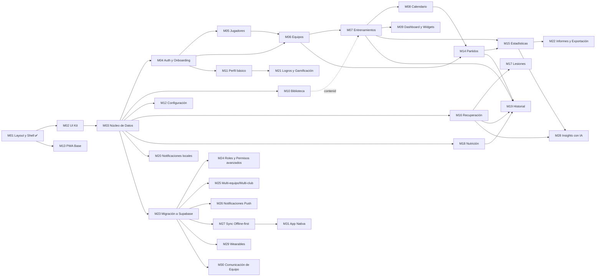

# F7 Performance Pro — Descomposición por Módulos y Roadmap

**Versión:** 1.0 — planificación de producto/ingeniería, sin código
**Rol:** CTO — división del proyecto en funcionalidades independientes, entregables y verificables por separado
**Complementa a:** `ARCHITECTURE.md`, `UX_DESIGN.md`, `DESIGN_SYSTEM.md`, `NAVIGATION_FLOW.md`, `DASHBOARD_WIDGETS.md`

> A partir de aquí el proyecto se construye **módulo por módulo**, no pantalla por pantalla. Cada módulo de este documento es una unidad de trabajo autocontenida: tiene su propio alcance, sus propios archivos, sus propios tests, y puede considerarse "terminado" (Definition of Done, §4) sin depender de que otro módulo esté completo — salvo las dependencias explícitas que se declaran en cada ficha.

---

## 1. Reglas del juego

**Niveles de prioridad**
| Nivel | Significado |
|---|---|
| **P0** | Bloqueante — sin este módulo no hay producto usable |
| **P1** | Core — la razón de ser de la app, va en el release principal de su fase |
| **P2** | Importante — mejora sustancial, puede correr en paralelo o justo después |
| **P3** | Futuro — valor claro pero no crítico para la fase actual |

**Niveles de complejidad y estimación**
| Nivel | Descripción | Rango |
|---|---|---|
| **Baja** | CRUD simple, poco estado compartido, sin gráficos | 2–4 días |
| **Media** | Varias entidades relacionadas, agregación de datos, varios estados de UI | 5–8 días |
| **Alta** | Analítica/gráficos complejos, múltiples integraciones internas, superficie de UI grande | 1.5–3 semanas |
| **Muy alta** | Cambios de infraestructura, migración de datos/backend, nueva capacidad de plataforma | 3–6+ semanas |

*Supuesto de estimación:* 1 desarrollador/a senior full-stack front-end dedicado por módulo (pair-programming en los de complejidad Alta/Muy alta). Los tiempos son de implementación + tests unitarios, no incluyen QA manual ni buffer de sprint.

**Convención de tests:** Vitest + React Testing Library para unit/integration (`ARCHITECTURE.md §11`); Playwright (ya disponible en el entorno) reservado para los 3–4 flujos end-to-end verdaderamente críticos del producto, marcados explícitamente.

---

## 2. Grafo de dependencias entre módulos

---

## 3. Catálogo de módulos

### FASE 0 — Fundacional

#### M01 — Layout y Shell ✅ *(completado)*
| Campo | Detalle |
|---|---|
| Objetivo | Estructura de navegación de toda la app: sidebar, bottom nav, topbar, sistema de rutas, tema claro/oscuro, transiciones. |
| Prioridad | P0 |
| Dependencias | Ninguna |
| Complejidad | Media |
| Tiempo estimado | 5 días *(ya entregado)* |
| Archivos afectados | `src/app/layout/**`, `src/app/router/**`, `src/app/providers/**`, `src/styles/index.css` |
| Componentes | `AppShell`, `Sidebar`, `BottomNav`, `Topbar`, `PageContainer`, `PagePlaceholder` |
| Stores | `uiStore` (theme, sidebarCollapsed) |
| Hooks | — |
| Rutas | Árbol completo de `NAVIGATION_FLOW.md §2` (placeholders) |
| Modelos | — |
| Tests | Render de `AppShell` en mobile/desktop, toggle de tema aplica `data-theme`, navegación actualiza ítem activo |

#### M02 — UI Kit / Design System
| Campo | Detalle |
|---|---|
| Objetivo | Librería de componentes base reutilizables en toda la app, implementando `DESIGN_SYSTEM.md §9` (cards, botones, inputs, badges, chips, tablas). |
| Prioridad | P0 |
| Dependencias | M01 |
| Complejidad | Media |
| Tiempo estimado | 6 días |
| Archivos afectados | `src/shared/components/ui/**`, `src/shared/components/motion/**`, `src/shared/components/feedback/**` |
| Componentes | `Button`, `Input`, `Select`, `Card`, `Badge`, `Chip`, `Modal`, `Drawer`/BottomSheet, `Tabs`, `Avatar`, `Tooltip`, `Skeleton`, `EmptyState`, `Spinner`, `Toast`/`ToastContainer`, `ConfirmDialog` |
| Stores | `shared/store` — `toastStore` (cola de toasts) |
| Hooks | `useDisclosure`, `useMediaQuery` |
| Rutas | — (librería transversal, sin rutas propias) |
| Modelos | — |
| Tests | Cada átomo con test de render + variantes + estados (default/hover/disabled/error), test de accesibilidad básica (roles ARIA, foco) |

#### M03 — Núcleo de Datos (Storage Adapter + convenciones de store)
| Campo | Detalle |
|---|---|
| Objetivo | Capa de persistencia intercambiable (`ARCHITECTURE.md §6.1`) y el patrón estándar de store Zustand que usarán todos los módulos de dominio. |
| Prioridad | P0 |
| Dependencias | M01 |
| Complejidad | Media |
| Tiempo estimado | 5 días |
| Archivos afectados | `src/shared/services/storage/**`, `src/shared/models/base.model.js`, `src/shared/models/enums.js`, `src/shared/utils/**` |
| Componentes | — |
| Stores | Patrón base documentado (no es un store en sí, es la plantilla que heredan `playersStore`, `teamsStore`, etc.) |
| Hooks | `useLocalStorage` |
| Rutas | — |
| Modelos | `BaseEntity { id, createdAt, updatedAt }`, `enums.js` (Position, Role, Category, MetricType...) |
| Tests | `LocalStorageAdapter`: CRUD completo, manejo de colecciones vacías, serialización/deserialización, colisión de IDs |

#### M04 — Autenticación y Onboarding
| Campo | Detalle |
|---|---|
| Objetivo | Alta de usuario, login local, flujo de onboarding (posición/equipo/medidas), guard de rutas autenticadas. |
| Prioridad | P0 |
| Dependencias | M02, M03 |
| Complejidad | Media |
| Tiempo estimado | 6 días |
| Archivos afectados | `src/features/auth/**` |
| Componentes | `LoginForm`, `OnboardingWelcome`, `OnboardingAthleteForm`, `RoleBadge` |
| Stores | `authStore` (currentUser, role, isAuthenticated) |
| Hooks | `useAuth` |
| Rutas | `/login`, `/onboarding` |
| Modelos | `User { id, name, email, role, teamIds[] }` |
| Tests | Guard `ProtectedRoute` redirige sin sesión, `RoleRoute` bloquea rol incorrecto, flujo onboarding completo (Vitest+RTL), **E2E Playwright:** onboarding → primer login → llega a Dashboard |

---

### FASE 1 — v1.0 (Núcleo operativo)

#### M05 — Gestión de Jugadores
| Campo | Detalle |
|---|---|
| Objetivo | CRUD de jugadores: alta, edición, ficha, estado (activo/lesionado/inactivo). |
| Prioridad | P0 |
| Dependencias | M04 |
| Complejidad | Media |
| Tiempo estimado | 5 días |
| Archivos afectados | `src/features/players/**` |
| Componentes | `PlayerCard`, `PlayerForm`, `PlayerAvatar`, `PlayerList`, `PlayerStatusBadge` |
| Stores | `playersStore` (players[], selectedPlayerId, filters, status) |
| Hooks | `usePlayers`, `usePlayer`, `usePlayerForm` |
| Rutas | `/players`, `/players/:id`, `/players/:id/edit` *(rol coach/admin)* |
| Modelos | `Player { id, teamId, firstName, lastName, dorsalNumber, position, birthDate, height, weight, photoUrl, dominantFoot, status }` |
| Tests | `playerService` CRUD, validación de formulario (dorsal duplicado, campos requeridos), `PlayerCard` render por estado |

#### M06 — Gestión de Equipos
| Campo | Detalle |
|---|---|
| Objetivo | CRUD de equipos y su plantilla (roster), selección de equipo activo. |
| Prioridad | P0 |
| Dependencias | M04, M05 |
| Complejidad | Baja |
| Tiempo estimado | 4 días |
| Archivos afectados | `src/features/teams/**` |
| Componentes | `TeamCard`, `TeamForm`, `RosterTable` |
| Stores | `teamsStore` (teams[], activeTeamId) |
| Hooks | `useTeams`, `useTeam`, `useRoster` |
| Rutas | `/teams`, `/teams/:id` *(rol coach/admin)* |
| Modelos | `Team { id, name, category, season, logoUrl, coachId, colorPrimary, colorSecondary }` |
| Tests | `teamService` CRUD, asignación/remoción de jugador al roster, cambio de equipo activo persiste en store |

#### M07 — Entrenamientos
| Campo | Detalle |
|---|---|
| Objetivo | Crear, editar, ejecutar y completar sesiones de entrenamiento; asistencia; ejercicios embebidos. |
| Prioridad | P0 |
| Dependencias | M06, M10 (referencia ejercicios de Biblioteca) |
| Complejidad | Alta |
| Tiempo estimado | 10 días |
| Archivos afectados | `src/features/trainings/**` |
| Componentes | `SessionCard`, `SessionForm` (modal), `ExerciseAccordion`, `AttendanceGrid`, `SessionStatusBadge` |
| Stores | `trainingsStore` (sessions[], selectedSessionId, filters) |
| Hooks | `useTrainingSessions`, `useTrainingSession`, `useAttendance` |
| Rutas | `/trainings`, `/trainings/:id` |
| Modelos | `TrainingSession { id, teamId, date, type, durationMinutes, exercises[], attendance[], notes, status }` |
| Tests | Ciclo completo crear→editar→completar sesión, cálculo de % asistencia, guard de "cambios sin guardar", **E2E Playwright:** Dashboard → empezar sesión de hoy → completar ejercicios → finalizar |

#### M08 — Calendario
| Campo | Detalle |
|---|---|
| Objetivo | Vistas mes/semana/día que agregan entrenamientos y partidos; navegación temporal. |
| Prioridad | P1 |
| Dependencias | M07 |
| Complejidad | Alta |
| Tiempo estimado | 8 días |
| Archivos afectados | `src/features/calendar/**` |
| Componentes | `CalendarGrid`, `EventCard`, `AgendaList`, `MonthNavigator`, `WeekDayTimeline` |
| Stores | `calendarStore` (events[] derivado) |
| Hooks | `useCalendarEvents` |
| Rutas | `/calendar` |
| Modelos | `CalendarEvent { id, sourceType, sourceId, date, title }` (derivado, no persistido directo) |
| Tests | Agregación correcta de eventos de múltiples fuentes, navegación de mes (swipe/flechas), selección de día actualiza agenda |

#### M09 — Dashboard y Widgets (set MVP)
| Campo | Detalle |
|---|---|
| Objetivo | Sistema de widgets personalizable con el subconjunto MVP de `DASHBOARD_WIDGETS.md` (Anillos, Sesión de Hoy, Racha, Próximos 7 días, Accesos rápidos). |
| Prioridad | P1 |
| Dependencias | M07, M08 |
| Complejidad | Alta |
| Tiempo estimado | 9 días |
| Archivos afectados | `src/features/dashboard/**` |
| Componentes | `WidgetGrid`, `PerformanceRingsWidget`, `TodaySessionWidget`, `StreakWidget`, `Next7DaysWidget`, `QuickAccessWidget`, `WidgetGallery`, `WidgetEditModeToggle` |
| Stores | `dashboardStore` (widgetLayout[], editMode) |
| Hooks | `useDashboardSummary`, `useDashboardLayout` |
| Rutas | `/dashboard` |
| Modelos | — (widget layout es config, no entidad de dominio) |
| Tests | Reordenar/quitar/añadir widget persiste layout, cada widget MVP renderiza sus 3 estados (vacío/cargando/error) |

#### M10 — Biblioteca de Ejercicios
| Campo | Detalle |
|---|---|
| Objetivo | Catálogo de ejercicios/drills buscable y filtrable, consumido por Entrenamientos. |
| Prioridad | P1 |
| Dependencias | M03 |
| Complejidad | Media |
| Tiempo estimado | 6 días |
| Archivos afectados | `src/features/library/**` |
| Componentes | `ExerciseCard`, `ExerciseDetail`, `ExerciseFilters`, `CollectionCard`, `AddToSessionSheet` |
| Stores | `libraryStore` (exercises[], filters, favorites[]) |
| Hooks | `useLibraryExercises`, `useExerciseDetail` |
| Rutas | `/library`, `/library/:exerciseId` |
| Modelos | `LibraryExercise { id, name, category, level, muscleGroups[], mediaUrl, instructions[] }` |
| Tests | Filtro combinado categoría+nivel, búsqueda por texto, "Añadir a sesión" inserta el ejercicio correcto en `trainingsStore` |

#### M11 — Perfil (básico)
| Campo | Detalle |
|---|---|
| Objetivo | Identidad del deportista: datos personales, stats de temporada, bio. (Sin gamificación todavía, ver M21). |
| Prioridad | P1 |
| Dependencias | M04 |
| Complejidad | Baja |
| Tiempo estimado | 4 días |
| Archivos afectados | `src/features/profile/**` |
| Componentes | `ProfileBanner`, `StatBlockRow`, `EditProfileModal` |
| Stores | Reutiliza `authStore` + `playersStore` |
| Hooks | `useProfile` |
| Rutas | `/profile` |
| Modelos | Extiende `User`/`Player` existentes |
| Tests | Edición de perfil persiste y refleja en banner, validación de formulario |

#### M12 — Configuración (básica)
| Campo | Detalle |
|---|---|
| Objetivo | Apariencia (tema), unidades, cuenta, exportar/borrar datos. |
| Prioridad | P1 |
| Dependencias | M03 |
| Complejidad | Baja |
| Tiempo estimado | 4 días |
| Archivos afectados | `src/features/settings/**` |
| Componentes | `SettingsGroup`, `ThemePreviewCard`, `ToggleRow`, `DestructiveActionDialog` |
| Stores | `settingsStore` (units, notificationPrefs), lee/escribe `uiStore.theme` |
| Hooks | `useSettings` |
| Rutas | `/settings` |
| Modelos | — |
| Tests | Exportar genera JSON válido de todas las colecciones, "Borrar datos" limpia LocalStorage y redirige a onboarding, cambio de tema persiste tras recarga |

#### M13 — PWA Base
| Campo | Detalle |
|---|---|
| Objetivo | Instalabilidad: manifest, iconos, prompt de instalación. (Sin caché offline avanzada todavía, ver M27). |
| Prioridad | P1 |
| Dependencias | M01 |
| Complejidad | Baja |
| Tiempo estimado | 3 días |
| Archivos afectados | `public/icons/**`, `public/manifest.webmanifest`, `vite.config.js` (plugin PWA) |
| Componentes | `InstallPrompt` (banner) |
| Stores | — |
| Hooks | `usePwaInstallPrompt` |
| Rutas | — |
| Modelos | — |
| Tests | Manifest válido (lighthouse/PWA checklist), banner de instalación aparece tras `beforeinstallprompt` |

---

### FASE 2 — v1.5 (Rendimiento y bienestar)

#### M14 — Partidos
| Campo | Detalle |
|---|---|
| Objetivo | Gestión de partidos: alineación, eventos en vivo, resultado. |
| Prioridad | P1 |
| Dependencias | M06, M08 |
| Complejidad | Alta |
| Tiempo estimado | 10 días |
| Archivos afectados | `src/features/matches/**` |
| Componentes | `MatchCard`, `LineupBoard`, `MatchTimeline`, `ScoreBoard`, `LiveMatchControls` |
| Stores | `matchesStore` (matches[], liveMatchState) |
| Hooks | `useMatches`, `useMatchStats`, `useLiveMatch` |
| Rutas | `/matches`, `/matches/:id`, `/matches/:id/live` *(control: coach/admin)* |
| Modelos | `Match { id, teamId, date, opponent, isHome, competition, result, lineup[], events[] }`, `MatchEvent { id, matchId, playerId, type, minute }` |
| Tests | Registro de evento en vivo actualiza marcador, alineación no permite dorsal duplicado, transición full-screen de `/live` |

#### M15 — Estadísticas y Rendimiento
| Campo | Detalle |
|---|---|
| Objetivo | Analítica de KPIs, tendencias, radar de perfil físico, comparación de jugadores (coach). |
| Prioridad | P1 |
| Dependencias | M07, M14 |
| Complejidad | Muy alta |
| Tiempo estimado | 12 días |
| Archivos afectados | `src/features/performance/**`, `src/shared/components/charts/**` |
| Componentes | `KpiCard`, `MetricTrendChart`, `PhysicalProfileRadar`, `SessionTypeDistributionChart`, `PlayerComparisonPanel`, `PlayerSelector` |
| Stores | `performanceStore` (metrics[], comparisonSelection) |
| Hooks | `usePerformanceMetrics`, `usePlayerComparison` |
| Rutas | `/stats` |
| Modelos | `PerformanceMetric { id, playerId, date, type, value, unit, context }`, `PhysicalTest { id, playerId, date, testType, resultValue, unit }` |
| Tests | Cálculo de tendencia/delta correcto, radar renderiza N series, selector de jugador (coach) recarga dataset, chart respeta tema claro/oscuro |

#### M16 — Recuperación y Bienestar
| Campo | Detalle |
|---|---|
| Objetivo | Gauge de recuperación, sueño, FC en reposo, HRV, check-in diario de bienestar. |
| Prioridad | P1 |
| Dependencias | M03 |
| Complejidad | Alta |
| Tiempo estimado | 8 días |
| Archivos afectados | `src/features/recovery/**` |
| Componentes | `RecoveryGauge`, `WellnessSubMetricCard`, `DailyCheckInSelector`, `RecoveryTrendChart` |
| Stores | `recoveryStore` (checkIns[], wellnessMetrics[]) |
| Hooks | `useRecoveryScore`, `useDailyCheckIn` |
| Rutas | `/recovery` |
| Modelos | `WellnessCheckIn { id, playerId, date, mood, muscleSoreness[], sleepHours, restingHr, hrv }` |
| Tests | Check-in de hoy no se puede duplicar, gauge calcula zona de color correctamente, colapso a resumen tras completar |

#### M17 — Lesiones
| Campo | Detalle |
|---|---|
| Objetivo | Registro y seguimiento de lesiones, integración con widget de alerta en Dashboard/Recuperación. |
| Prioridad | P2 |
| Dependencias | M16 |
| Complejidad | Media |
| Tiempo estimado | 5 días |
| Archivos afectados | `src/features/injuries/**` |
| Componentes | `InjuryCard`, `InjuryTimeline`, `InjuryForm`, `InjuryProgressBar` |
| Stores | `injuriesStore` (injuries[]) |
| Hooks | `useInjuries`, `useActiveInjury` |
| Rutas | Modal/detalle accesible desde Recuperación/Perfil/Historial (sin ruta propia de primer nivel) |
| Modelos | `Injury { id, playerId, type, bodyPart, severity, startDate, endDate, status }` |
| Tests | Marcar lesión como resuelta actualiza `Player.status`, widget de alerta se oculta cuando no hay lesión activa |

#### M18 — Nutrición
| Campo | Detalle |
|---|---|
| Objetivo | Registro de comidas, macros, hidratación, resumen calórico diario/semanal. |
| Prioridad | P2 |
| Dependencias | M03 |
| Complejidad | Media |
| Tiempo estimado | 7 días |
| Archivos afectados | `src/features/nutrition/**` |
| Componentes | `CalorieRing`, `MacroBars`, `MealCard`, `AddMealModal`, `HydrationTracker`, `WeeklyCalorieChart` |
| Stores | `nutritionStore` (meals[], hydrationLog[], dailyTarget) |
| Hooks | `useNutritionSummary`, `useHydration` |
| Rutas | `/nutrition` |
| Modelos | `MealEntry { id, playerId, date, mealType, foodName, calories, macros }`, `HydrationEntry { id, playerId, date, amountMl }` |
| Tests | Anillo calórico recalcula al añadir/eliminar comida, hidratación suma incremental correctamente |

#### M19 — Historial Unificado
| Campo | Detalle |
|---|---|
| Objetivo | Log cronológico buscable de toda la actividad (entrenamientos, partidos, tests, check-ins). |
| Prioridad | P2 |
| Dependencias | M07, M14, M16, M18 |
| Complejidad | Media |
| Tiempo estimado | 6 días |
| Archivos afectados | `src/features/history/**` |
| Componentes | `HistoryListItem`, `MonthGroupHeader` (sticky), `HistoryFilters`, `HistoryTableView` (desktop) |
| Stores | `historyStore` (vista derivada, sin persistencia propia) |
| Hooks | `useHistoryFeed` |
| Rutas | `/history` |
| Modelos | — (agrega entidades de otros módulos) |
| Tests | Agregación multi-fuente ordenada por fecha, filtros combinados, agrupación mensual con sticky header |

#### M20 — Notificaciones Locales
| Campo | Detalle |
|---|---|
| Objetivo | Recordatorios in-app (sesión de hoy, check-in pendiente) sin backend — Notification API local/badge counts. |
| Prioridad | P2 |
| Dependencias | M03 |
| Complejidad | Baja |
| Tiempo estimado | 4 días |
| Archivos afectados | `src/shared/services/notifications/**`, `src/shared/components/feedback/NotificationBell.jsx` |
| Componentes | `NotificationBell`, `NotificationPanel` |
| Stores | `notificationsStore` (items[], unreadCount) |
| Hooks | `useNotifications` |
| Rutas | Panel desde Topbar, sin ruta propia |
| Modelos | `NotificationItem { id, type, title, body, read, createdAt, targetRoute }` |
| Tests | Badge de contador refleja no-leídas, tap marca como leída y navega a `targetRoute` |

---

### FASE 3 — v2.0 (Escala y backend real)

#### M21 — Logros y Gamificación
| Campo | Detalle |
|---|---|
| Objetivo | Sistema de medallas/trofeos, racha, timeline de actividad en Perfil. |
| Prioridad | P2 |
| Dependencias | M11 |
| Complejidad | Media |
| Tiempo estimado | 7 días |
| Archivos afectados | `src/features/profile/achievements/**` |
| Componentes | `AchievementGrid`, `AchievementDetailModal`, `ActivityTimeline`, `StreakBadge` |
| Stores | `achievementsStore` (unlocked[], progress{}) |
| Hooks | `useAchievements` |
| Rutas | `/profile` tab Logros/Actividad |
| Modelos | `Achievement { id, name, criteria, icon, unlockedAt }` |
| Tests | Motor de reglas desbloquea logro al cumplir criterio, animación "shine" solo la primera vez que se ve desbloqueado |

#### M22 — Informes y Exportación (coach)
| Campo | Detalle |
|---|---|
| Objetivo | Exportar analítica de equipo/jugador a PDF/CSV para uso fuera de la app. |
| Prioridad | P2 |
| Dependencias | M15 |
| Complejidad | Media |
| Tiempo estimado | 6 días |
| Archivos afectados | `src/features/reports/**` |
| Componentes | `ReportBuilder`, `ExportPanel`, `ReportPreview` |
| Stores | Reutiliza `performanceStore` |
| Hooks | `useReportData` |
| Rutas | `/reports` *(coach/admin)* |
| Modelos | — |
| Tests | Export CSV contiene columnas esperadas, export PDF genera archivo válido |

#### M23 — Migración a Supabase
| Campo | Detalle |
|---|---|
| Objetivo | Reemplazar `LocalStorageAdapter` por `SupabaseAdapter` (misma interfaz), auth real, base de datos remota. |
| Prioridad | P0 *(para v2.0)* |
| Dependencias | M03 |
| Complejidad | Muy alta |
| Tiempo estimado | 4 semanas |
| Archivos afectados | `src/shared/services/storage/SupabaseAdapter.js`, `src/shared/services/storage/storageProvider.js`, `src/features/auth/**`, esquema SQL/RLS en Supabase |
| Componentes | — (transparente a la UI por diseño del adapter) |
| Stores | `authStore` migra a Supabase Auth (session, refresh token) |
| Hooks | `useSupabaseSession` |
| Rutas | Sin cambios de rutas |
| Modelos | Traducción de todos los modelos existentes a tablas Postgres + políticas RLS |
| Tests | Suite completa de `LocalStorageAdapter` re-ejecutada contra `SupabaseAdapter` (mismo contrato), migración de datos de un usuario piloto, **E2E Playwright:** login real, CRUD de jugador persiste tras recargar en otro navegador |

#### M24 — Roles y Permisos Avanzados
| Campo | Detalle |
|---|---|
| Objetivo | Permisos granulares más allá de admin/coach/analyst/player (ej. asistente, fisio con acceso solo a Recuperación/Lesiones). |
| Prioridad | P2 |
| Dependencias | M23 |
| Complejidad | Alta |
| Tiempo estimado | 10 días |
| Archivos afectados | `src/app/router/RoleRoute.jsx`, `src/features/auth/**`, políticas RLS en Supabase |
| Componentes | `PermissionGate` |
| Stores | Extiende `authStore` con `permissions[]` |
| Hooks | `usePermissions` |
| Rutas | Guards adicionales en rutas existentes |
| Modelos | `Permission`, `RoleDefinition` |
| Tests | Matriz de permisos × rutas, acceso restringido correcto por combinación de rol/permiso |

#### M25 — Multi-equipo / Multi-club
| Campo | Detalle |
|---|---|
| Objetivo | Un coach/admin gestiona varios equipos o clubes desde la misma cuenta; aislamiento de datos por `clubId`. |
| Prioridad | P2 |
| Dependencias | M23 |
| Complejidad | Alta |
| Tiempo estimado | 12 días |
| Archivos afectados | `src/features/teams/**`, `src/shared/store/tenantStore.js`, esquema Supabase (columna `clubId` + RLS) |
| Componentes | `ClubSwitcher` (en Topbar) |
| Stores | `tenantStore` (activeClubId) |
| Hooks | `useActiveClub` |
| Rutas | Sin nuevas rutas, filtra datos existentes por tenant |
| Modelos | `Club { id, name, logoUrl }`, `Team.clubId` |
| Tests | Cambiar de club recarga todos los stores con datos aislados, ningún query cruza `clubId` |

#### M26 — Notificaciones Push
| Campo | Detalle |
|---|---|
| Objetivo | Push reales vía Service Worker + Supabase (recordatorios, logros, convocatorias). |
| Prioridad | P2 |
| Dependencias | M20, M23 |
| Complejidad | Alta |
| Tiempo estimado | 10 días |
| Archivos afectados | `src/shared/services/notifications/push.js`, service worker, Supabase Edge Function de envío |
| Componentes | `NotificationPermissionPrompt` |
| Stores | Extiende `notificationsStore` |
| Hooks | `usePushSubscription` |
| Rutas | Deep link desde notificación a la ruta destino (`NAVIGATION_FLOW.md §9`) |
| Modelos | `PushSubscription` |
| Tests | Suscripción se registra y persiste, tap en push abre la ruta correcta con app cerrada |

#### M27 — Sincronización Offline-first
| Campo | Detalle |
|---|---|
| Objetivo | La app sigue siendo 100% usable sin conexión y sincroniza cambios pendientes al reconectar, con resolución de conflictos. |
| Prioridad | P1 *(para v2.0)* |
| Dependencias | M23 |
| Complejidad | Muy alta |
| Tiempo estimado | 3 semanas |
| Archivos afectados | `src/shared/services/sync/**`, service worker (estrategias de caché) |
| Componentes | `OfflineBanner`, `SyncStatusIndicator` |
| Stores | `syncStore` (pendingChanges[], syncStatus) |
| Hooks | `useOnlineStatus`, `useSyncQueue` |
| Rutas | — |
| Modelos | `PendingChange { id, entity, operation, payload, timestamp }` |
| Tests | Cola de cambios se aplica en orden al reconectar, conflicto de edición concurrente se resuelve según estrategia definida (last-write-wins documentado explícitamente), **E2E Playwright:** completar sesión offline → reconectar → verificar sync |

---

### FASE 4 — v3.0 (Inteligencia y expansión)

#### M28 — Insights con IA / Recomendaciones del Coach
| Campo | Detalle |
|---|---|
| Objetivo | Recomendaciones generadas automáticamente a partir de carga/recuperación/rendimiento (evoluciona el widget "Consejo del Día" de heurística simple a modelo real). |
| Prioridad | P2 |
| Dependencias | M15, M16 |
| Complejidad | Muy alta |
| Tiempo estimado | 4 semanas |
| Archivos afectados | `src/features/insights/**`, servicio de inferencia (Edge Function/API externa) |
| Componentes | `InsightCard`, `InsightHistoryList` |
| Stores | `insightsStore` |
| Hooks | `useDailyInsight` |
| Rutas | Widget en Dashboard, sin ruta propia inicialmente |
| Modelos | `Insight { id, playerId, date, message, basedOn[], severity }` |
| Tests | Fallback a heurística simple si el servicio de inferencia falla, insights no se repiten en días consecutivos sin cambios relevantes |

#### M29 — Integración con Wearables
| Campo | Detalle |
|---|---|
| Objetivo | Sincronizar sueño, FC, HRV, distancia/velocidad automáticamente desde Garmin Connect / Apple Health / Google Fit, reemplazando la carga manual. |
| Prioridad | P2 |
| Dependencias | M23 |
| Complejidad | Muy alta |
| Tiempo estimado | 5 semanas |
| Archivos afectados | `src/shared/services/integrations/**`, OAuth callbacks, Edge Functions de ingesta |
| Componentes | `DeviceConnectionCard`, `SyncHistoryLog` |
| Stores | `integrationsStore` (connectedDevices[]) |
| Hooks | `useDeviceSync` |
| Rutas | Sección en `/settings` |
| Modelos | `ConnectedDevice { id, provider, status, lastSyncAt }` |
| Tests | Datos importados no duplican registros manuales existentes, reconexión tras token expirado |

#### M30 — Comunicación de Equipo
| Campo | Detalle |
|---|---|
| Objetivo | Anuncios del coach y mensajería básica de equipo (convocatorias, avisos), primer paso hacia una capa social. |
| Prioridad | P3 |
| Dependencias | M23, M26 |
| Complejidad | Alta |
| Tiempo estimado | 3 semanas |
| Archivos afectados | `src/features/team-chat/**` |
| Componentes | `AnnouncementFeed`, `ComposeAnnouncementModal`, `MessageThread` |
| Stores | `teamChatStore` (announcements[], threads[]) |
| Hooks | `useAnnouncements`, `useTeamThread` |
| Rutas | `/team/announcements` |
| Modelos | `Announcement { id, teamId, authorId, body, createdAt }` |
| Tests | Solo coach/admin puede publicar anuncios, notificación push se dispara al equipo completo |

#### M31 — App Nativa (Capacitor)
| Campo | Detalle |
|---|---|
| Objetivo | Empaquetar la PWA como app nativa iOS/Android manteniendo el mismo código base (`ARCHITECTURE.md` Fase 5). |
| Prioridad | P3 |
| Dependencias | M27 |
| Complejidad | Muy alta |
| Tiempo estimado | 4 semanas |
| Archivos afectados | `capacitor.config.ts`, `ios/**`, `android/**`, ajustes de `SQLiteAdapter` para almacenamiento nativo offline |
| Componentes | Wrappers nativos de notificaciones/cámara si aplica |
| Stores | Sin cambios funcionales, cambia el adapter de persistencia activo |
| Hooks | — |
| Rutas | Sin cambios (mismo router) |
| Modelos | Sin cambios de esquema |
| Tests | Build nativo instala y arranca en simulador iOS/Android, `SQLiteAdapter` pasa la misma suite de contrato que `LocalStorageAdapter`/`SupabaseAdapter` |

---

## 4. Definition of Done (aplica a todos los módulos)

Un módulo no se considera terminado hasta que cumple **todos** los puntos:

1. Los componentes usan únicamente component tokens del Design System (`DESIGN_SYSTEM.md §11`, checklist ya definido).
2. Store(s) del módulo solo llaman a su `service` correspondiente, nunca al `StorageAdapter` directamente.
3. Los 3 estados obligatorios (vacío/cargando/error) están implementados donde aplique, siguiendo `NAVIGATION_FLOW.md §5`.
4. Cobertura de tests: servicios y stores al 100% de sus ramas críticas; componentes con al menos un test de render + un test de interacción.
5. Verificado manualmente en navegador (mobile + desktop, claro + oscuro) antes de marcar como cerrado.
6. Sin warnings de consola ni errores de accesibilidad básicos (roles ARIA, contraste).
7. Documentado en su `index.js` de barrel export — nada fuera del módulo importa sus internos directamente.

---

## 5. Roadmap de versiones

```mermaid
gantt
    title F7 Performance Pro — Roadmap v1.0 → v3.0
    dateFormat  X
    axisFormat  %s

    section Fase 0 — Fundacional
    M01 Layout y Shell            :done, f0a, 0, 5
    M02 UI Kit                    :f0b, after f0a, 6
    M03 Núcleo de Datos           :f0c, after f0b, 5
    M04 Auth y Onboarding         :f0d, after f0c, 6

    section v1.0 — Núcleo operativo
    M05 Jugadores                 :v1a, after f0d, 5
    M06 Equipos                   :v1b, after v1a, 4
    M10 Biblioteca                :v1c, after f0c, 6
    M07 Entrenamientos            :v1d, after v1b, 10
    M08 Calendario                :v1e, after v1d, 8
    M09 Dashboard MVP             :v1f, after v1e, 9
    M11 Perfil básico             :v1g, after f0d, 4
    M12 Configuración             :v1h, after f0c, 4
    M13 PWA Base                  :v1i, after f0a, 3

    section v1.5 — Rendimiento y bienestar
    M14 Partidos                  :v15a, after v1e, 10
    M15 Estadísticas              :v15b, after v15a, 12
    M16 Recuperación              :v15c, after f0c, 8
    M17 Lesiones                  :v15d, after v15c, 5
    M18 Nutrición                 :v15e, after f0c, 7
    M19 Historial                 :v15f, after v15e, 6
    M20 Notificaciones locales    :v15g, after f0c, 4

    section v2.0 — Escala y backend
    M23 Migración a Supabase      :v2a, after v15f, 20
    M21 Logros y Gamificación     :v2b, after v1g, 7
    M22 Informes y Exportación    :v2c, after v15b, 6
    M24 Roles avanzados           :v2d, after v2a, 10
    M25 Multi-club                :v2e, after v2a, 12
    M26 Notificaciones Push       :v2f, after v2a, 10
    M27 Sync Offline-first        :v2g, after v2a, 15

    section v3.0 — Inteligencia y expansión
    M28 Insights con IA           :v3a, after v2g, 20
    M29 Wearables                 :v3b, after v2a, 25
    M30 Comunicación de Equipo    :v3c, after v2f, 15
    M31 App Nativa                :v3d, after v2g, 20
```

| Versión | Foco | Módulos incluidos | Criterio de release |
|---|---|---|---|
| **v1.0** | Producto usable de punta a punta con un equipo, en un dispositivo, con datos locales | M01–M13 | Un coach puede crear equipo, dar de alta jugadores, planificar y completar entrenamientos, y ver su calendario y dashboard — todo con persistencia local. |
| **v1.5** | Ciclo de rendimiento y bienestar completo | M14–M20 | Se puede seguir un jugador de principio a fin: entrenar, competir, medir rendimiento, cuidar recuperación/nutrición, y todo queda en el Historial. |
| **v2.0** | Backend real, multi-usuario, multi-equipo | M21–M27 | Los datos viven en Supabase, varios coaches/clubes usan la app simultáneamente con roles reales, y funciona offline con sync. |
| **v3.0** | Diferenciación e inteligencia | M28–M31 | La app recomienda, se conecta a wearables reales, habilita comunicación de equipo, y existe como app nativa además de PWA. |

Este documento, junto con `ARCHITECTURE.md`, `UX_DESIGN.md`, `DESIGN_SYSTEM.md`, `NAVIGATION_FLOW.md` y `DASHBOARD_WIDGETS.md`, es la referencia de planificación completa: de aquí en adelante cada turno de desarrollo implementa **un módulo de esta lista**, en el orden que marca el grafo de dependencias (§2).
