# F7 Performance Pro — Mapa de Navegación y User Flows

**Versión:** 1.0 — especificación de navegación, sin código
**Complementa a:** `ARCHITECTURE.md` (rutas técnicas), `UX_DESIGN.md` (contenido de cada pantalla), `DESIGN_SYSTEM.md` (tokens de motion/elevación usados en las transiciones)

Este documento responde una sola pregunta desde cualquier punto de la app: **¿a dónde puedo ir desde aquí, cómo llego, y qué pasa mientras tanto?** Cubre el 100% de pantallas, todos sus estados (carga/vacío/error/éxito), todos los modales y diálogos, y el tipo exacto de transición entre cada par de pantallas.

Los diagramas usan sintaxis Mermaid (se renderizan nativamente en GitHub).

---

## 1. Mapa global de navegación (Site Map)

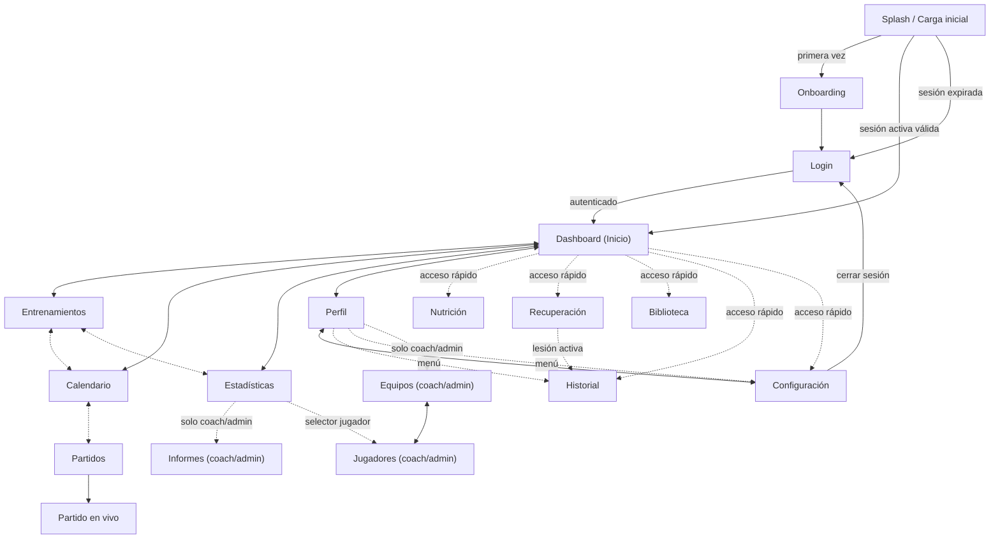

**Lectura del diagrama:** flechas sólidas bidireccionales = navegación primaria (siempre visible en bottom nav/sidebar). Flechas punteadas = accesos secundarios/contextuales (desde una card, un menú o un rol específico). `Perfil ↔ Configuración` es bidireccional porque cada una tiene un acceso directo a la otra (icono de ajustes en Perfil, botón "Volver al perfil" en Configuración).

---

## 2. Inventario completo de pantallas y rutas

| Ruta | Pantalla | Rol requerido | Tipo de acceso |
|---|---|---|---|
| `/onboarding` | Onboarding | público | Primera apertura |
| `/login` | Login | público | Splash sin sesión |
| `/dashboard` | Dashboard | cualquiera | **Primario** (tab 1) |
| `/trainings` | Entrenamientos (lista) | cualquiera | **Primario** (tab 2) |
| `/trainings/:id` | Detalle de sesión | cualquiera | Push desde lista/Dashboard/Calendario |
| `/calendar` | Calendario | cualquiera | **Primario** (tab 3) |
| `/stats` | Estadísticas | cualquiera | **Primario** (tab 4) |
| `/profile` | Perfil | cualquiera | **Primario** (tab 5) |
| `/nutrition` | Nutrición | cualquiera | Secundario (acceso rápido) |
| `/recovery` | Recuperación | cualquiera | Secundario (acceso rápido) |
| `/library` | Biblioteca | cualquiera | Secundario (acceso rápido) |
| `/library/:exerciseId` | Detalle de ejercicio | cualquiera | Modal/push desde Biblioteca |
| `/history` | Historial | cualquiera | Secundario (acceso rápido / menú Perfil) |
| `/settings` | Configuración | cualquiera | Secundario (menú Perfil) |
| `/matches` | Partidos | cualquiera | Secundario (desde Calendario/Historial) |
| `/matches/:id` | Detalle de partido | cualquiera | Push desde Partidos/Calendario/Historial |
| `/matches/:id/live` | Partido en vivo | coach/admin | Push desde Detalle de partido, el día del evento |
| `/teams` | Equipos | coach, admin | Secundario (menú Perfil, rol restringido) |
| `/teams/:id` | Detalle de equipo | coach, admin | Push desde Equipos |
| `/players` | Jugadores | coach, admin | Push desde Detalle de equipo |
| `/players/:id` | Detalle de jugador | coach, admin | Push desde Jugadores / selector en Estadísticas |
| `/reports` | Informes | coach, admin | Secundario (desde Estadísticas, rol restringido) |
| `*` | No encontrado (404) | — | Fallback |

Los roles no listados explícitamente (`cualquiera`) están disponibles para `admin`, `coach`, `analyst` y el rol base `player`. Las rutas marcadas `coach, admin` usan `RoleRoute` (`ARCHITECTURE.md §4`): un `player` que intente acceder por URL directa ve el estado **"Acceso restringido"** (§8).

---

## 3. Navegación primaria por pantalla

Para cada pantalla: qué está **siempre** disponible (nav global) + a qué se puede saltar **desde el contenido** de esa pantalla específicamente.

### Dashboard
- Siempre: bottom nav/sidebar completo, FAB (+).
- Contextual → `Entrenamientos/:id` (card "Hoy"), `Calendario` (tira semanal, tap en día), `Estadísticas` (card "Progreso reciente"), `Recuperación` (card de gauge), `Nutrición`/`Biblioteca`/`Historial`/`Configuración` (accesos rápidos), `Notificaciones` (icono campana → panel/lista).
- FAB abre bottom sheet con 3 acciones: *Nueva sesión* → `/trainings` (form modal), *Registrar comida* → modal de Nutrición, *Check-in de recuperación* → `/recovery` con card de check-in enfocada.

### Entrenamientos
- Siempre: nav global.
- Contextual → `Detalle de sesión` (tap en card), `Calendario` (icono de vista calendario), `Biblioteca` (desde detalle, botón "Añadir ejercicio"). FAB → modal "Nueva sesión". Menú `⋮` por card → *Editar* (push a form), *Duplicar* (crea copia, permanece en lista), *Eliminar* (dialog de confirmación).

### Calendario
- Siempre: nav global.
- Contextual → `Detalle de sesión` o `Detalle de partido` (tap en evento de la agenda), `+` → modal "Nuevo evento" con selector de tipo (Entrenamiento/Partido/Evaluación/Otro) que redirige al formulario correspondiente.

### Nutrición
- Siempre: nav global (acceso secundario, sin tab propio — se llega desde Dashboard/Perfil).
- Contextual → modal "Registrar comida" (FAB o card "+ Añadir alimento"), expandir card de comida (no navega, expande in-place), `Estadísticas` (link "Ver tendencia completa" desde el gráfico semanal).

### Recuperación
- Siempre: nav global.
- Contextual → `Historial de lesiones` (card de alerta si hay lesión activa), `Estadísticas` (link desde gráfico de tendencia de 14 días), check-in diario (interacción in-place, no navega).

### Biblioteca
- Siempre: nav global.
- Contextual → `Detalle de ejercicio` (tap en card), desde el detalle → "Añadir a sesión" abre selector de sesión (modal: sesión de hoy / elegir otra / crear nueva → deep link a `/trainings/:id` o al form).

### Perfil
- Siempre: nav global.
- Contextual → `Configuración` (icono ajustes), `Historial` (tab Actividad → "Ver todo"), `Estadísticas` (tab Estadísticas del perfil → "Ver análisis completo"), modal "Editar perfil", modal de detalle de logro (tab Logros). Coach/admin → `Equipos`.

### Configuración
- Siempre: nav global.
- Contextual → sub-pantallas push (Cuenta, Notificaciones), modal de confirmación (Borrar datos), acción *Cerrar sesión* → `Login` (con dialog de confirmación previo).

### Historial
- Siempre: nav global.
- Contextual → detalle correspondiente según tipo de item (`Entrenamientos/:id`, `Matches/:id`, detalle de test, detalle de logro), bottom sheet de filtros.

### Estadísticas
- Siempre: nav global.
- Contextual → selector de jugador (coach/admin, abre modal/dropdown → puede llevar a `Jugadores/:id`), panel de comparación (expande in-place), `Informes` (botón exportar, coach/admin).

---

## 4. Inventario maestro de modales y diálogos

| # | Nombre | Disparador | Tipo (mobile / desktop) | Contenido | Acciones | Al confirmar |
|---|---|---|---|---|---|---|
| 1 | Acciones rápidas (FAB) | Tap FAB en Dashboard | Bottom sheet / Popover anclado | 3 opciones con icono | Nueva sesión / Registrar comida / Check-in | Navega o abre el modal correspondiente |
| 2 | Nueva sesión de entrenamiento | FAB en Entrenamientos, "+" en Calendario | Bottom sheet (mobile) / Modal centrado (desktop) | Formulario: tipo, fecha, duración, equipo | Cancelar / Guardar | Cierra modal, inserta card en lista, toast "Sesión creada" |
| 3 | Editar sesión | Menú ⋮ → Editar | Igual que #2, precargado | Mismo formulario con valores actuales | Cancelar (con guard de cambios) / Guardar | Actualiza card, toast "Cambios guardados" |
| 4 | Confirmar eliminación de sesión | Menú ⋮ → Eliminar | Alert dialog centrado (ambos) | Texto de advertencia, no reversible | Cancelar / Eliminar (rojo) | Elimina, toast con **Deshacer** (5s) |
| 5 | Nuevo evento de calendario | "+" en Calendario | Bottom sheet / Modal | Selector de tipo → redirige a #2 o a form de partido | Cancelar / Continuar | Abre el form específico |
| 6 | Registrar comida | FAB, "+ Añadir alimento" en Nutrición | Bottom sheet (mobile) / Modal (desktop) | Buscador de alimento, cantidad, comida del día | Cancelar / Añadir | Cierra, actualiza anillo calórico animado, toast |
| 7 | Selector de jugador | Dropdown en Estadísticas (coach) | Popover (desktop) / Bottom sheet con buscador (mobile) | Lista de jugadores del equipo activo | Buscar, seleccionar | Recarga Estadísticas con el jugador elegido |
| 8 | Añadir a sesión (desde Biblioteca) | Botón en Detalle de ejercicio | Bottom sheet / Popover | Sesión de hoy / elegir otra / nueva sesión | Cancelar / Confirmar | Añade ejercicio, toast, opción "Ir a la sesión" |
| 9 | Detalle de logro | Tap en medalla, tab Logros de Perfil | Modal centrado (ambos) | Icono, nombre, criterio, progreso | Cerrar | Cierra, sin navegación |
| 10 | Editar perfil | Icono ✏️ en banner de Perfil | Modal (desktop) / Página push (mobile, por longitud del form) | Foto, nombre, posición, datos físicos | Cancelar (guard) / Guardar | Actualiza banner/stats, toast |
| 11 | Confirmar borrar datos | Configuración → Datos → Borrar todo | Alert dialog con fricción (escribir "BORRAR" o mantener presionado 1s) | Advertencia fuerte, irreversible | Cancelar / Confirmar (rojo, deshabilitado hasta cumplir fricción) | Borra LocalStorage, redirige a Onboarding |
| 12 | Confirmar cerrar sesión | Configuración → Cerrar sesión | Alert dialog | "¿Seguro que quieres cerrar sesión?" | Cancelar / Cerrar sesión | Limpia `authStore`, navega a `/login` |
| 13 | Descartar cambios (guard genérico) | Salir de cualquier formulario con cambios sin guardar | Alert dialog | "Tienes cambios sin guardar" | Seguir editando / Descartar | Descartar → navega a destino original pendiente |
| 14 | Filtros avanzados | Icono filtro en Biblioteca/Historial (mobile) | Bottom sheet | Checkboxes de categoría/tipo, rango de fecha | Limpiar / Aplicar | Cierra, re-renderiza lista filtrada |
| 15 | Detalle de lesión | Card de alerta en Recuperación, item en Historial | Modal (desktop) / Página push (mobile) | Tipo, severidad, fechas, progreso de recuperación | Cerrar / Editar (coach) | Actualiza estado si se edita |
| 16 | Acceso restringido | Navegación directa a ruta de rol no permitido | Modal/página de error (ambos) | Icono candado, "No tienes permiso para ver esto" | Volver al inicio | Redirige a `/dashboard` |
| 17 | Error genérico / algo salió mal | Fallo de `ErrorBoundary` | Página completa (ambos) | Ilustración, mensaje, detalles técnicos colapsables (dev) | Reintentar / Volver al inicio | Reintenta render o navega a `/dashboard` |
| 18 | Instalar app (PWA) | `beforeinstallprompt` capturado, banner tras 2ª visita | Banner inferior no bloqueante (ambos) | Icono app, "Instala F7 Performance Pro" | Ahora no / Instalar | Dispara prompt nativo del navegador |
| 19 | Selector de tema | Configuración → Apariencia | Inline (no modal), 3 preview cards | Claro / Oscuro / Sistema | Tap para seleccionar | Cross-fade global de tema (ver `DESIGN_SYSTEM.md §5.2`) |

---

## 5. Inventario maestro de estados de pantalla

| Pantalla | Loading | Empty | Error | Éxito/confirmación |
|---|---|---|---|---|
| Dashboard | Skeleton de anillos + cards | "Día de descanso 😌" en card "Hoy" | Banner inline "No se pudo cargar tu resumen — Reintentar" | Toast al completar acciones desde FAB |
| Entrenamientos | 3 skeleton cards | Ilustración + "Aún no hay entrenamientos" + CTA "Crear el primero" | Estado de lista con botón "Reintentar" | Toast "Sesión creada/actualizada/eliminada" |
| Calendario | Skeleton de grid de mes | Agenda vacía: "Sin actividades — día libre" | — (datos locales, prácticamente no falla) | — |
| Nutrición | Skeleton de anillo + lista | 3 slots vacíos (Desayuno/Almuerzo/Cena) invitando a registrar | Banner inline si falla el guardado | Toast "Alimento añadido", anillo se re-anima |
| Recuperación | Skeleton de gauge | Check-in con badge "Pendiente" hasta completarse | — | Confirmación inline: check-in colapsa a resumen de una línea |
| Biblioteca | Skeleton de grid | "No encontramos ejercicios para «X»" + limpiar filtros | Estado de grid con "Reintentar" | Toast "Añadido a la sesión" + acción "Ir a la sesión" |
| Perfil | Skeleton de banner+stats | Tab Actividad: "Tu historial empieza hoy 💪"; Tab Logros: "0/24 desbloqueados" | Banner inline | Toast "Perfil actualizado" |
| Configuración | — (datos locales instantáneos) | — | Toast de error si exportar falla | Toast "Datos exportados", "Cambios guardados" |
| Historial | Skeleton de lista agrupada | "No encontramos actividad para estos filtros" | Estado de lista con "Reintentar" | — |
| Estadísticas | Skeleton de KPIs + charts | Card individual: "Necesitas al menos 3 registros para ver tendencias" | Card individual con "Reintentar" por gráfico | — |
| Global | — | — | **Offline banner** persistente (`material-thin`, arriba) "Sin conexión — mostrando datos guardados" | Toast "Conectado de nuevo, sincronizando…" |

**Regla transversal:** ningún estado de error dentro de una pantalla bloquea el resto de la pantalla — son inline/localizados (card o sección afectada), salvo el error crítico de `ErrorBoundary` (#17) que sí es de página completa porque significa que React no pudo renderizar.

---

## 6. Sistema de transiciones

| Tipo de navegación | Animación | Duración/token | Cuándo se usa |
|---|---|---|---|
| Cambio de tab (bottom nav/sidebar) | Cross-fade de contenido + indicador activo desliza (`layoutId`) | `duration-base` (250ms), `ease-in-out` | Entre las 5 pantallas primarias |
| Push (lista → detalle) | Slide-in desde la derecha (mobile) / sin animación, panel ya visible (desktop split view) | `duration-base`, `ease-out` | Entrenamientos, Historial, Biblioteca, Equipos→Jugadores |
| Pop (volver atrás) | Slide-out hacia la derecha (reverso exacto del push) | `duration-base`, `ease-out` | Botón back / gesto swipe-back / hardware back Android |
| Modal centrado (desktop) | Fade + `scale(0.96→1)` del modal, fade del scrim | `duration-fast` a `duration-base` | Modales #2, #3, #9, #16 en desktop |
| Bottom sheet (mobile) | Slide-up desde borde inferior + fade del scrim, drag-to-dismiss habilitado | `duration-base`, `ease-out` | Modales #1, #2, #6, #7 (mobile), #14 |
| Toast | Slide-up + fade (mobile, desde abajo) / slide-in + fade (desktop, esquina sup. derecha) | `duration-fast` entrada, auto-dismiss 3.5s con barra de progreso | Confirmaciones de acción (§4, columna "Al confirmar") |
| Alert dialog | Fade + `scale(0.96→1)` centrado, sin slide | `duration-fast` | Confirmaciones destructivas (#4, #11, #12, #13) |
| Cambio de mes en Calendario | Slide horizontal completo (izq/der según dirección) | `duration-base`, `ease-in-out` | Flechas `←/→` o swipe gesture |
| Cambio de tema (claro↔oscuro) | Cross-fade global de toda la superficie visible | `duration-base` a `duration-slow` (300–400ms) | Selector de tema en Configuración, toggle rápido |
| Partido en vivo (`/matches/:id/live`) | Slide-up **full-screen** (sin scrim, reemplaza todo el viewport, tiene su propio botón de minimizar) | `duration-base` | Solo el día/hora del evento, acceso desde Detalle de partido |
| Anillos/gauges/gráficos al montar | Dibujo progresivo (stroke/arc), nunca instantáneo | `duration-slow` (700–1000ms), `ease-out` | Cada vez que la pantalla que los contiene se monta o cambia de rango |
| Logout | Fade a negro breve → fade-in de Login | `duration-base` × 2 | Tras confirmar modal #12 |

---

## 7. Flujos de usuario críticos

### 7.1 Onboarding y primer login

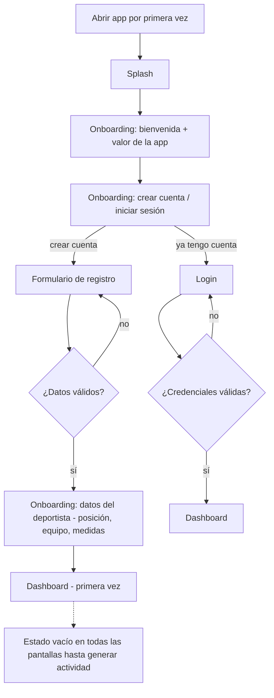

### 7.2 Completar el entrenamiento de hoy

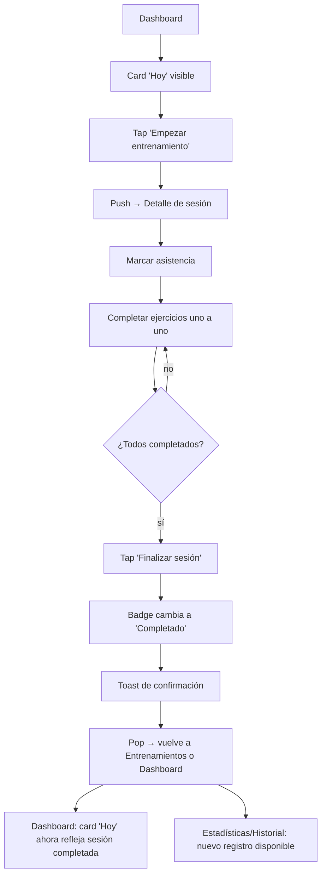

### 7.3 Registrar una comida

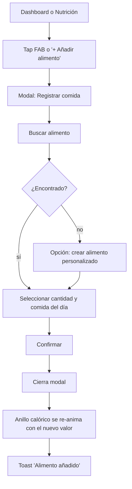

### 7.4 Check-in de recuperación diario

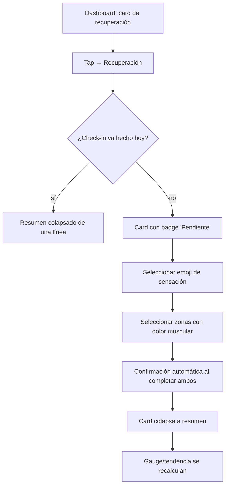

### 7.5 Explorar Biblioteca y añadir ejercicio a una sesión

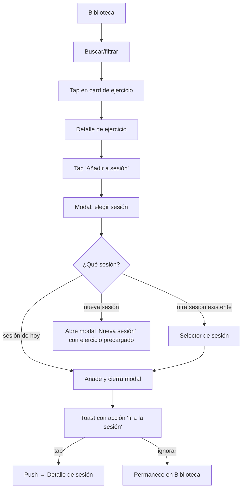

### 7.6 Coach: comparar jugadores en Estadísticas

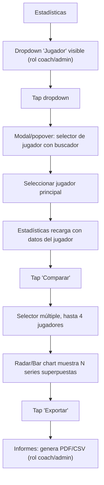

### 7.7 Cambiar de tema

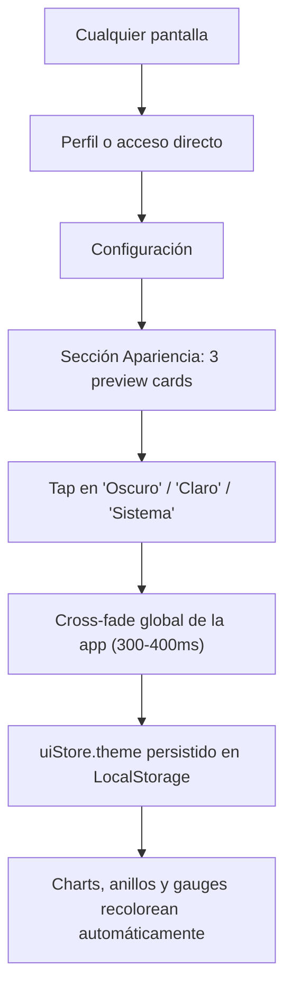

### 7.8 Manejo de error y modo offline

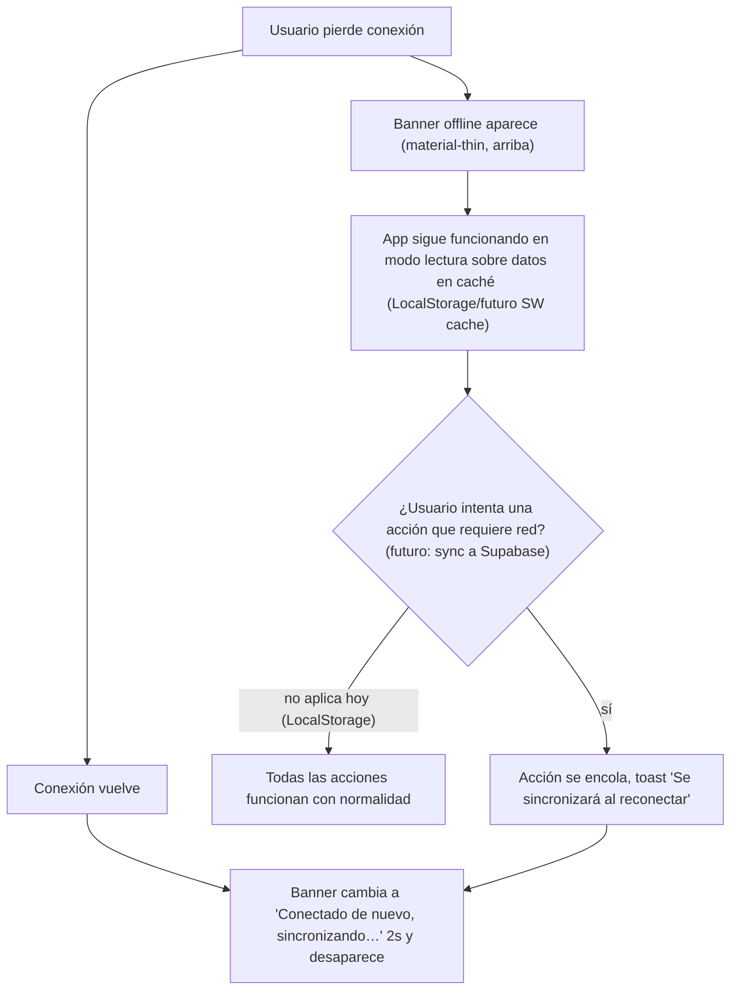

### 7.9 Descartar cambios (guard genérico)

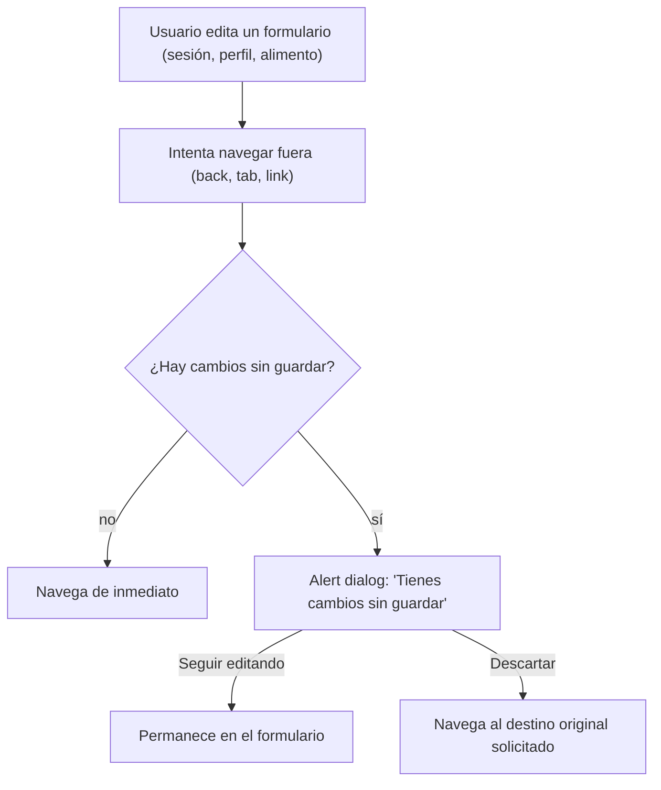

### 7.10 Cerrar sesión

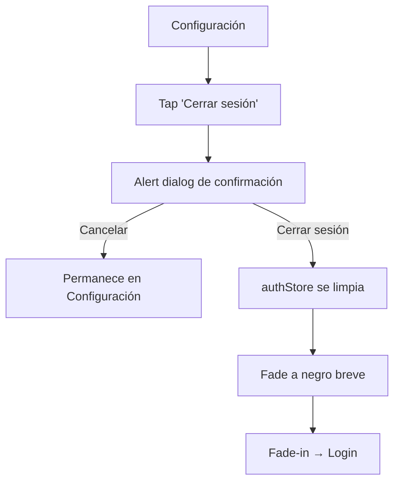

---

## 8. Guards de navegación

| Guard | Se activa cuando | Comportamiento |
|---|---|---|
| **Auth guard** (`ProtectedRoute`) | Se intenta acceder a cualquier ruta autenticada sin sesión válida | Redirige a `/login`, preserva la ruta destino para volver tras autenticar |
| **Role guard** (`RoleRoute`) | Un `player` navega directamente a una ruta `coach/admin` (URL manual, deep link, back/forward del navegador) | Muestra modal/página "Acceso restringido" (#16) → botón único "Volver al inicio" |
| **Unsaved changes guard** | Cualquier formulario con estado "dirty" intenta perder foco de navegación | Alert dialog #13, bloquea la navegación hasta que el usuario decide |
| **Session guard** | Sesión expira mientras la app está abierta (futuro, con Supabase Auth) | Banner inline + redirección suave a `/login` conservando el intento de acción pendiente |

---

## 9. Deep linking, atajos PWA y notificaciones

- **Atajos del manifest** (`ARCHITECTURE.md §10`): "Nuevo entrenamiento" → abre directamente el modal #2 sobre `/trainings`; "Ver dashboard" → `/dashboard`. Ambos saltan cualquier pantalla intermedia (no pasan por Splash si ya hay sesión).
- **Notificaciones push** (futuro): "Es hora de tu entrenamiento" → `/trainings/:id` (detalle, con CTA "Empezar" ya visible); "Nuevo logro desbloqueado" → `/profile` tab Logros con la medalla nueva resaltada (animación shine, ver `UX_DESIGN.md §7`); "Recordatorio de check-in" → `/recovery` con la card de check-in enfocada/scrolleada a la vista.
- **Compartir/deep link externo** (futuro): un link a un partido específico (`/matches/:id`) debe funcionar en frío (usuario sin sesión) → pasa primero por `ProtectedRoute`, tras login redirige de vuelta a la ruta original.

---

## 10. Diferencias de navegación por rol

| Elemento | Jugador (`player`) | Coach / Admin |
|---|---|---|
| Tabs primarios | Inicio · Entrenar · Calendario · Estadísticas · Perfil (datos propios) | Idénticos, pero Estadísticas/Entrenamientos muestran selector de jugador/equipo |
| Menú de Perfil | Historial, Configuración | + Equipos, + Informes |
| Estadísticas | Solo su propio perfil físico | Selector de jugador + modo comparación multi-jugador |
| Entrenamientos | Ve sesiones de su equipo, marca su propia asistencia | Crea/edita/elimina sesiones, gestiona asistencia de todo el equipo |
| Partido en vivo | Solo lectura (marcador, eventos) si se comparte | Control completo (alineación, eventos, sustituciones) |
| Rutas bloqueadas | `/teams`, `/players`, `/reports` → guard de rol (#16) | Ninguna |

---

## 11. Cierre: alcanzabilidad

Con esta estructura, **cualquier pantalla es alcanzable desde cualquier otra en máximo 2 pasos**: (1) nav primaria/secundaria de vuelta a Dashboard o Perfil, (2) acceso directo desde ahí al destino — sin callejones sin salida. Todo modal/bottom sheet tiene una vía de cierre explícita (botón, backdrop tap, gesto de arrastre o `Escape` en desktop) y ninguna acción destructiva ocurre sin un diálogo de confirmación intermedio (§4, filas #4, #11, #12).

Con `ARCHITECTURE.md`, `UX_DESIGN.md`, `DESIGN_SYSTEM.md` y este documento, la especificación previa a implementación queda completa: cómo se construye, cómo se ve, con qué tokens, y cómo se navega.
